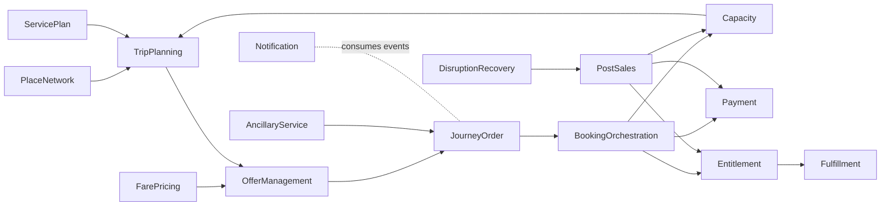

# 当前服务依赖图与目标 DDD 映射

Last updated: 2026-06-28

## 目的

这份文档记录当前 Train Ticket 仓库里的服务调用依赖，并把这些历史服务粗略映射到目标 DDD 上下文。它不是目标架构，也不是推荐继续沿用的服务拆分。

目标是：

1. 后续重构时知道哪些当前服务处在交易主链路上。
2. 找出哪些依赖是历史腐化造成的跨域调用。
3. 为迁移到 `docs/01-ddd-high-level/context-map.md` 中的目标上下文提供对照。

## 当前调用矩阵

这部分来自代码中的 `getServiceUrl("...")` 调用和已恢复的功能文档。

| 调用方 | 被调用服务 | 当前角色 |
|---|---|---|
| `ts-admin-basic-info-service` | config, contacts, price, station, train | 后台基础数据代理。 |
| `ts-admin-order-service` | order, order-other | 后台订单代理。 |
| `ts-admin-route-service` | route, station | 后台路线代理。 |
| `ts-admin-travel-service` | route, station, train, travel, travel2 | 后台车次代理。 |
| `ts-admin-user-service` | user | 后台用户代理。 |
| `ts-auth-service` | verification-code | 登录认证。 |
| `ts-basic-service` | price, route, station, train | 基础数据聚合查询。 |
| `ts-cancel-service` | inside-payment, notification, order, order-other, user | 取消订单和退款入口。 |
| `ts-consign-service` | consign-price | 托运下单和计价。 |
| `ts-execute-service` | order, order-other | 取票、进站、执行。 |
| `ts-food-delivery-service` | station-food | 餐饮配送。 |
| `ts-food-service` | station-food, train-food, travel | 餐食查询和订餐。 |
| `ts-inside-payment-service` | order, order-other, payment | 内部支付、退款和余额。 |
| `ts-order-service` | station | 普通车订单。 |
| `ts-order-other-service` | station | 高铁/其他订单。 |
| `ts-preserve-service` | assurance, basic, consign, contacts, food, order, seat, security, station, travel, user | 普通车订票编排。 |
| `ts-preserve-other-service` | assurance, basic, consign, contacts, food, order-other, seat, security, station, travel2, user | 高铁/其他订票编排。 |
| `ts-rebook-service` | inside-payment, order, order-other, route, seat, train, travel, travel2 | 改签和差价。 |
| `ts-route-plan-service` | route, travel, travel2 | 路线规划。 |
| `ts-seat-service` | config, order, order-other | 座位分配和余票。 |
| `ts-security-service` | order, order-other | 安全检查。 |
| `ts-travel-plan-service` | route-plan, seat, train, travel, travel2 | 行程推荐。 |
| `ts-travel-service` | basic, route, seat, train | 普通车车次查询。 |
| `ts-travel2-service` | basic, route, seat, train | 高铁/其他车次查询。 |
| `ts-user-service` | auth | 用户与账号。 |
| `ts-wait-order-service` | preserve | 候补订单轮询和兑现。 |

## 当前依赖分层

| 分层 | 当前服务 | 问题 |
|---|---|---|
| 入口编排 | preserve, preserve-other, cancel, rebook, wait-order | 交易编排散落，缺少统一 Saga 和状态机。 |
| 订单记录 | order, order-other | 高铁/普通车复制模型，订单不拥有完整业务生命周期。 |
| 库存座席 | seat | 依赖订单反推库存，缺少可信 CapacityHold。 |
| 支付退款 | inside-payment, payment | 支付、余额、退款和订单状态耦合。 |
| 车次目录 | travel, travel2, train, route, station, price, basic | 高铁/普通车分裂，运行计划和查询混在一起。 |
| 售后履约 | cancel, rebook, execute | 取消、改签、取票、进站分散且状态边界弱。 |
| 附加服务 | assurance, food, consign, delivery | 附加服务和主票交易边界不清。 |
| 后台代理 | admin-* | 多数是薄代理，目标应进入 Admin & Audit。 |

## 目标 DDD 映射

| 当前服务 | 目标上下文 | 迁移建议 |
|---|---|---|
| `ts-preserve-service`, `ts-preserve-other-service` | Booking Orchestration, Journey Order | 合并订票编排，移除高铁/普通车复制边界。 |
| `ts-order-service`, `ts-order-other-service` | Journey Order, SegmentBooking | 订单和分段预订分离，订单只做商业汇总。 |
| `ts-seat-service` | Capacity & Availability | 重建 CapacityHold 和区间库存模型。 |
| `ts-inside-payment-service`, `ts-payment-service` | Payment | 统一 PaymentIntent、Refund、晚到回调和对账。 |
| `ts-travel-service`, `ts-travel2-service`, `ts-train-service` | Service Plan, Trip Planning | 车次分类变成字段，不再分裂服务。 |
| `ts-route-service`, `ts-station-service`, `ts-basic-service` | Place & Network, Service Plan | 基础地点和运行计划分开。 |
| `ts-price-service` | Fare & Pricing | 票价和退改规则版本化。 |
| `ts-cancel-service` | Post Sales | 取消和退票进入统一售后聚合。 |
| `ts-rebook-service` | Post Sales, Booking Orchestration | 改签用新旧 SegmentBooking 和差价 Saga 表达。 |
| `ts-execute-service` | Fulfillment, Entitlement & Ticketing | 取票、检票、进站、完成进入履约上下文。 |
| `ts-wait-order-service` | Capacity & Availability, Waitlist | 候补变成库存释放事件驱动，不再轮询 preserve。 |
| `ts-food-service`, `ts-food-delivery-service`, `ts-train-food-service`, `ts-station-food-service` | Ancillary Service | 餐饮作为附加服务独立确认和履约。 |
| `ts-consign-service`, `ts-consign-price-service` | Ancillary Service, Fare & Pricing | 托运订单和托运计价分离。 |
| `ts-assurance-service` | Ancillary Service | 保险改名为 Insurance Policy，避免 assurance 语义混淆。 |
| `ts-notification-service` | Notification | 事件驱动通知，不阻塞订单主链路。 |
| `ts-security-service` | Risk & Compliance | 风控不直接拥有订单。 |
| `ts-contacts-service`, `ts-user-service`, `ts-auth-service`, `ts-verification-code-service` | Account, Traveler Profile | 账号、旅客资料、认证分层。 |
| `ts-admin-*` | Admin & Audit | 后台操作走受控命令和审计。 |
| `ts-news-service`, `ts-ticket-office-service`, `ts-avatar-service`, `ts-voucher-service` | 待归类支撑能力 | 与交易核心弱耦合，迁移后置。 |

## 关键腐化依赖

| 依赖 | 问题 | 目标 |
|---|---|---|
| preserve -> seat/order/payment/food/assurance/consign | 订票入口承担过多跨域职责。 | Booking Orchestration 只编排，不内嵌附加服务规则。 |
| seat -> order/order-other | 库存从订单反推，无法可信锁座。 | CapacityHold 成为库存事实来源。 |
| inside-payment -> order/order-other | 支付上下文直接修改订单语义。 | Payment 只发布资金事件，订单通过 Saga 收敛。 |
| rebook -> travel/travel2/order/order-other/seat/payment | 改签跨越所有核心上下文。 | PostSalesCase + Booking Saga。 |
| wait-order -> preserve | 候补通过重新调用订票入口兑现。 | Waitlist 消费 CapacityReleased 事件。 |
| admin-* -> 多服务 | 后台绕过领域命令。 | Admin & Audit 通过受控命令操作目标上下文。 |

## 目标依赖方向

## 迁移切片

| 阶段 | 目标 | 当前服务切入 |
|---|---|---|
| 1 | 冻结现状 API 和调用链 | preserve, order, seat, inside-payment, cancel, rebook。 |
| 2 | 引入 Offer 和 JourneyOrder | preserve/order 层外包一层新订单模型。 |
| 3 | 引入 CapacityHold | seat 从订单反推改为锁库存事实。 |
| 4 | 引入 PaymentIntent 和 Outbox | inside-payment 不再直接推进订单。 |
| 5 | 引入 Entitlement | execute 和 order 的票证状态拆出来。 |
| 6 | 引入 PostSalesCase | cancel/rebook 合并为售后上下文。 |
| 7 | 合并 travel/travel2 | 车次类型字段化，查询统一。 |
| 8 | 候补事件化 | wait-order 消费 CapacityReleased。 |

## 设计结论

当前服务依赖不是目标边界。重构时应优先围绕 `Offer -> JourneyOrder -> SegmentBooking -> CapacityHold -> PaymentIntent -> Entitlement -> PostSalesCase` 建立新主链路，再逐步把历史服务迁移到对应上下文。
