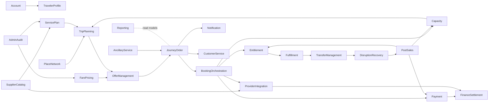

# 出行平台 DDD 上下文地图

Last updated: 2026-06-28

## 目的

这份文档定义 Train Ticket 重构和 General Travel 扩展时的限界上下文、上下游关系和集成方式。它回答三个问题：

1. 哪些领域是核心域，应该被认真建模。
2. 哪些领域是支撑域或通用域，可以先保持简单。
3. 上下文之间如何协作，哪些关系必须通过防腐层隔离。

本文使用 `docs/01-ddd-high-level/domain-glossary.md` 中的统一语言。

## 战略域划分

| 类型 | 上下文 | 判断 |
|---|---|---|
| 核心域 | Trip Planning | General Travel 平台的方案生成能力，决定用户是否能找到可行出行。 |
| 核心域 | Offer Management | 把可售性、价格、票规、风险和有效期冻结成可交易快照。 |
| 核心域 | Booking Orchestration | 多段预订、占座、供应商确认、失败补偿的编排中心。 |
| 核心域 | Journey Order | 用户视角的商业订单和售后入口。 |
| 核心域 | Capacity & Availability | 固定班次库存、动态运力、配额和可用性判断；候补队列是否独立由 reduce 决策。 |
| 核心域 | Transfer Management | 联乘、中转可达性、保障契约和错过接续判断。 |
| 核心域 | Disruption Recovery | 延误、取消、停运、停航、司机取消等异常恢复。 |
| 支撑域 | Service Plan | 固定班次运行计划、运营日历、计划性停运和运行版本。 |
| 支撑域 | Fare & Pricing | 票价、税费、手续费、优惠和售后规则。 |
| 支撑域 | Entitlement & Ticketing | 出票、票证、登机牌、乘车码等权益凭证。 |
| 支撑域 | Fulfillment | 检票、值机、登乘、行程完成等履约事实。 |
| 支撑域 | Post Sales | 退票、改签、改程、差价和手续费规则执行。 |
| 支撑域 | Provider Integration | 外部铁路、航司、大巴、船司、网约车接口适配。 |
| 支撑域 | Ancillary Service | 行李、保险、餐饮、接送、站内服务。 |
| 通用域 | Account | 账号、登录、会话和账号安全。 |
| 通用域 | Traveler Profile | 旅客、证件、偏好和资质。 |
| 通用域 | Place & Network | 城市、地址、车站、机场、港口、POI 和网络关系。 |
| 通用域 | Payment | 支付、预授权、扣款、退款和差价。 |
| 通用域 | Notification | 事件通知、模板、发送和重试。 |
| 通用域 | Customer Service | 工单、申诉、人工干预。 |
| 通用域 | Finance Settlement | 对账、清算、发票、收入确认。 |
| 通用域 | Risk & Compliance | 反刷、黑名单、重复行程、合规限制。 |
| 通用域 | Reporting | 销售、履约、收入、库存和异常报表。 |
| 通用域 | Admin & Audit | 权限、后台配置、审批和审计。 |

## 上下文关系类型

| 关系 | 含义 | 本项目使用方式 |
|---|---|---|
| Customer/Supplier | 下游按上游发布的能力或事件协作 | Trip Planning 消费 Service Plan、Capacity、Fare。 |
| Published Language | 通过稳定事件或契约集成 | JourneyOrderCreated、PaymentCaptured、EntitlementIssued 等。 |
| Anti-Corruption Layer | 对外部模型做翻译，避免污染核心域 | Provider Integration 对接航司 PNR、网约车派单、铁路票号等。 |
| Open Host Service | 上下文对外提供稳定 API | Payment、Notification、Offer Management 对内提供服务。 |
| Shared Kernel | 极少数共享基础概念 | Money、TimeWindow、PlaceId、TravelerId 可共享；业务状态不共享。 |
| Separate Ways | 不强行集成 | 报表离线模型不应反向影响交易核心。 |

## 总体上下文图

## 核心交易上下游

| 上游 | 下游 | 关系 | 契约 | 说明 |
|---|---|---|---|---|
| Place & Network | Trip Planning | Customer/Supplier | PlaceGraph、TransportNode | 搜索和中转依赖稳定地点网络。 |
| Service Plan | Trip Planning | Customer/Supplier | ServiceSegment、Schedule | 固定班次方案来自运行计划。 |
| Capacity & Availability | Trip Planning | Customer/Supplier | AvailabilitySnapshot | 查询只消费可用性快照，不锁库存。 |
| Fare & Pricing | Offer Management | Customer/Supplier | FareQuote、FareRule | Offer 冻结价格和票规。 |
| Trip Planning | Offer Management | Customer/Supplier | Itinerary | Offer 不负责生成路线，只对方案报价。 |
| Offer Management | Journey Order | Published Language | OfferQuoted、OfferExpired | 订单必须引用有效 Offer。 |
| Journey Order | Booking Orchestration | Customer/Supplier | CreateSegmentBookings | 订单创建后由编排上下文确认各段。 |
| Booking Orchestration | Capacity & Availability | Open Host Service | HoldCapacity、ReleaseHold | 对内部库存执行锁定和释放。 |
| Booking Orchestration | Provider Integration | ACL | ReserveWithProvider、CancelProviderReservation | 对外部供应商执行预留、确认和取消。 |
| Booking Orchestration | Payment | Open Host Service | AuthorizePayment、CapturePayment | 支付是资金能力，不决定能否出票。 |
| Booking Orchestration | Entitlement & Ticketing | Open Host Service | IssueEntitlement | 只有确认和支付满足规则后才出票。 |
| Entitlement & Ticketing | Fulfillment | Published Language | EntitlementIssued、EntitlementVoided | 履约核验票证状态。 |
| Fulfillment | Transfer Management | Published Language | SegmentArrived、SegmentDelayed | 中转风险依赖实际履约时间。 |
| Disruption Recovery | Post Sales | Customer/Supplier | RecoveryOptionAccepted | 异常恢复可触发免费退改。 |
| Post Sales | Payment | Open Host Service | RequestRefund、RequestExtraCharge | 售后决定金额和原因，支付执行资金动作。 |

## 供应侧上下文

| 上下文 | 上游 | 下游 | 边界说明 |
|---|---|---|---|
| Supplier Catalog | Admin & Audit | Provider Integration, Service Plan | 记录供应商、承运商、合同和能力，不处理订单。 |
| Service Plan | Supplier Catalog, Admin & Audit | Trip Planning, Capacity | 固定班次计划，不表达某个用户的购买事实。 |
| Capacity & Availability | Service Plan, Provider Integration | Trip Planning, Booking Orchestration, Post Sales | 内部库存和外部可用性都在这里归一，但内部实现可以特化。 |
| Fare & Pricing | Supplier Catalog, Admin & Audit | Offer Management, Post Sales | 票价和退改规则的权威来源。 |
| Provider Integration | 外部供应商 | Booking Orchestration, Capacity, Finance Settlement | 防腐层，只翻译供应商语言。 |

## 用户侧上下文

| 上下文 | 上游 | 下游 | 边界说明 |
|---|---|---|---|
| Account | 用户、渠道 | Traveler Profile, Journey Order | 只管理账号身份，不保存旅客票证状态。 |
| Traveler Profile | Account | Offer Management, Journey Order, Risk & Compliance | 旅客证件和资质是下单校验输入。 |
| Risk & Compliance | Account, Traveler Profile, Journey Order | Trip Planning, Journey Order, Payment | 风控给出允许、拒绝、挑战或限流决策。 |
| Customer Service | Journey Order, Payment, Entitlement, Provider Integration | Post Sales, Payment, Notification | 人工处理必须通过受控命令进入业务上下文。 |

## 订单和履约上下文

| 上下文 | 上游 | 下游 | 边界说明 |
|---|---|---|---|
| Journey Order | Offer Management, Account, Traveler Profile | Booking Orchestration, Payment, Customer Service | 用户商业订单，不直接持有供应商状态机。 |
| Booking Orchestration | Journey Order, Capacity, Provider Integration, Payment | Entitlement, Notification, Disruption Recovery | 多段确认和补偿 Saga 的拥有者。 |
| Entitlement & Ticketing | Booking Orchestration, Post Sales | Fulfillment, Notification | 票证或权益凭证的生命周期。 |
| Fulfillment | Entitlement, Provider Integration | Journey Order, Transfer Management, Finance Settlement | 记录值机、检票、登乘、完成等实际事实。 |
| Transfer Management | Trip Planning, Fulfillment, Disruption Recovery | Offer Management, Disruption Recovery, Customer Service | 中转可达性和保障契约。 |
| Post Sales | Journey Order, Fare & Pricing, Entitlement, Disruption Recovery | Payment, Capacity, Provider Integration, Notification | 售后规则执行和跨上下文变更编排。 |

## 财务和运营上下文

| 上下文 | 上游 | 下游 | 边界说明 |
|---|---|---|---|
| Payment | Journey Order, Booking Orchestration, Post Sales | Finance Settlement, Notification | 只保证资金状态，不保证票证状态。 |
| Finance Settlement | Payment, Provider Integration, Fulfillment | Reporting, Admin & Audit | 对账、清算、收入确认和发票。 |
| Notification | 所有业务事件 | 用户、客服、运营 | 不参与业务决策，失败可重试。 |
| Reporting | 业务事件和读模型 | 运营、财务、管理端 | 只读分析，不反向修改交易状态。 |
| Admin & Audit | 管理员 | Service Plan, Fare & Pricing, Customer Service | 高风险操作需要权限、审批和审计。 |

## 交通方式特化边界

| 特化上下文 | 对外统一语言 | 内部专有语言 | 集成方式 |
|---|---|---|---|
| Rail Capacity & Ticketing | Segment Booking、Entitlement、Capacity Hold | 车次、席别、区间票额、候补、检票 | 内部作为 Capacity 和 Entitlement 的特化实现。 |
| Air Booking & Fulfillment | Segment Booking、Entitlement、Fulfillment Event | PNR、票号、舱位、票价族、值机、登机牌 | 通过 Provider Integration ACL 对接航司/GDS/NDC。 |
| Coach Booking | Segment Booking、Entitlement | 班线、上车点、座位、电子票码 | 可复用 Rail 的固定班次模式，但库存规则更简单。 |
| Ride Dispatch | Segment Booking、Ride Assignment、Fulfillment Event | 司机、车辆、ETA、派单、等待费、取消费 | 通过 Dispatch 上下文接入，不套固定班次库存。 |
| Ferry Booking | Segment Booking、Entitlement | 船班、舱房、铺位、车辆甲板、港口安检 | 固定班次加多种容量单元。 |

## 读写模型分离

| 读模型 | 数据来源 | 用途 | 不变量 |
|---|---|---|---|
| Search Index | Place、Service Plan、Availability、Fare | 高性能搜索和排序 | 允许短暂过期，下单前必须重新确认。 |
| Offer Read Model | Offer Management | 展示报价详情 | Offer 必须有有效期和版本。 |
| Order Timeline | Journey Order、Booking、Payment、Ticketing、Fulfillment | 用户和客服查看订单全链路 | 只读汇总，不做状态推进。 |
| Inventory Dashboard | Capacity、Booking、Post Sales | 运营查看余票、锁票、释放和差异 | 不直接修库存，修正走受控命令。 |
| Disruption Dashboard | Service Plan、Fulfillment、Provider Integration | 异常影响范围和恢复进度 | 不直接退款或改签。 |

## 上下文边界红线

1. `Journey Order` 不能直接扣减库存，必须通过 `Booking Orchestration` 或 `Capacity & Availability`。
2. `Payment` 不能决定是否允许退票或改签，规则来自 `Fare & Pricing` 和 `Post Sales`。
3. `Entitlement` 不能根据支付状态自行出票，出票必须由编排上下文触发。
4. `Provider Integration` 不能把供应商状态码直接暴露给核心域，必须映射为平台事件。
5. `Reporting` 不能反向修正交易状态，修正必须通过 `Admin & Audit` 下的受控命令。
6. `Trip Planning` 返回的是候选方案，不能承诺最终可售；最终可售由 `Offer` 和下单确认共同保证。
7. `Transfer Management` 不能只看计划时刻，必须能消费实际延误、到达和取消事件。

## 第一阶段建议上下文集

为了先把火车票务重构稳，可以先落地以下上下文：

1. Place & Network
2. Service Plan
3. Capacity & Availability
4. Fare & Pricing
5. Trip Planning
6. Offer Management
7. Journey Order
8. Booking Orchestration
9. Payment
10. Entitlement & Ticketing
11. Post Sales
12. Provider Integration
13. Notification
14. Admin & Audit

第一阶段的 Provider Integration 可以只落最小 ACL：供应商状态映射、支付渠道协议适配、幂等、签名验签和 raw archive，不承载核心订单规则。网约车、飞机、轮船和完整联乘可以先作为模型预留，不必第一阶段实现完整供应商集成。
