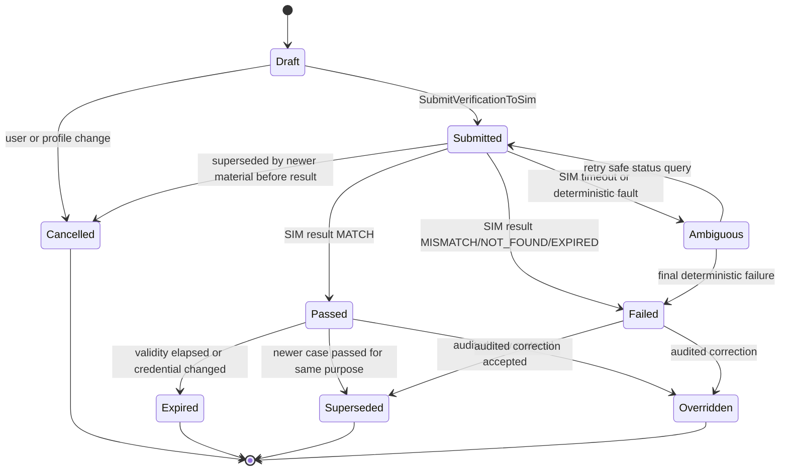
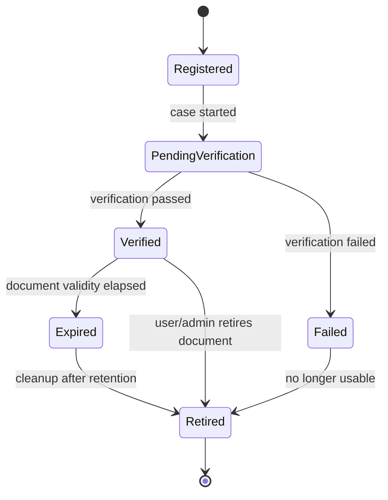
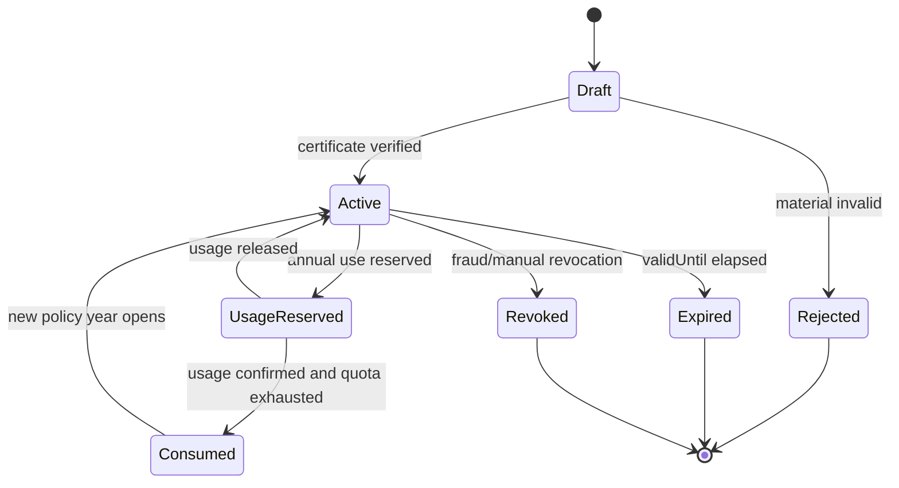
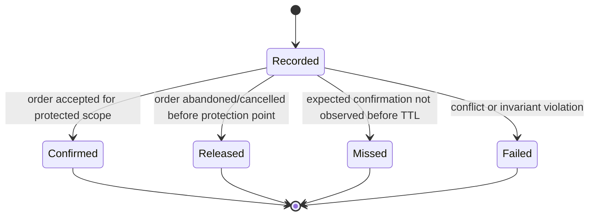

# Identity Verification Domain Design

## Metadata

| Field | Value |
|---|---|
| Domain | Identity Verification |
| Status | proposed-ddd-baseline |
| Owner Agent | agentm-identity-verification |
| Last Updated | 2026-07-10 |
| High-Level Inputs | `docs/adr/0003-commercial-realism-scope.md` |

## 1. 领域目标

Identity Verification 负责面向中国铁路实名购票场景的身份核验与证件级合规事实：对 SIM 公安网关发起实名核验案例（VerificationCase）、登记并归并同一自然人的多个证件（CredentialRecord）、维护学生/儿童/军残等优惠资质证书（EligibilityCertificate），并产出按证件购票限制事实供 Risk & Compliance 消费。

本 domain 从 Traveler Profile 中拆出，是因为 Traveler Profile 是旅客资料与授权的通用主数据，而实名核验、证件归并、优惠证书有效期/年度次数和按证件限购事实具有独立合规不变量。Journey Order、Fare & Pricing 和 Risk & Compliance 需要可查询、可审计、可重放的核验事实，而不是直接依赖用户资料或外部网关状态。

## 2. 边界

### In Scope

- `VerificationCase`：针对身份证/护照等证件的实名核验请求、SIM 公安网关调用记录、结果归档、过期重验和人工审计覆盖。
- `CredentialRecord`：身份证、护照等证件登记；同一自然人多证归并；证件有效期、脱敏展示、哈希索引和主证件引用。
- `EligibilityCertificate`：学生、儿童、军残等优惠资质证书的登记、核验、有效期、撤销和年度使用次数占用/释放。
- 证件级购买限制事实：证件在给定出行日期、产品、席别/票种或政策窗口内的已占用次数、阻断原因和事实版本。
- 与 `traveler-profile` 的 TravelerId 关联与快照消费；不复制完整旅客主数据。
- 向 `journey-order` 提供下单前核验态查询结果；向 `fare-pricing` 提供优惠资质查询结果；向 `risk-compliance` 发布限购事实。
- 证件号、姓名、出生日期等敏感字段的字段级加密、哈希索引、脱敏读模型和审计访问。

### Out of Scope

- Account 登录身份、密码、MFA、会话和账号封禁，归 Account / Risk & Compliance。
- Traveler Profile 的资料编辑、联系人、偏好、授权和 ProfileSnapshot 生成。
- Journey Order 的商业订单状态、支付、取消和售后生命周期。
- Risk & Compliance 的最终风控判定、黑名单、反刷、设备指纹和多账号关联。
- Fare & Pricing 的票价计算、优惠金额、规则发布和价格快照。
- Entitlement & Ticketing 的票号、乘车码、登乘凭证和履约核验。
- 真实公安、学信、军残或铁路接口集成；本域只使用确定性、可种子化的 SIM 网关防腐层，无真实网络调用。

## 3. 统一语言补充

| Term | Definition | Notes |
|---|---|---|
| VerificationCase | 一次对特定证件材料进行实名核验的案例。 | 记录请求指纹、SIM 网关结果、有效期和失败原因；历史案例不可覆盖。 |
| CredentialRecord | 平台对一个证件的合规登记记录。 | 支持 `ID_CARD`、`PASSPORT`；只在加密区保存明文，普通事件/读模型只带 masked 与 hash 引用。 |
| IdentityCluster | 一人多证归并后的自然人簇。 | 由人工审计、SIM 结果或可信资料版本归并；不等于 Account，也不等于 TravelerProfile。 |
| EligibilityCertificate | 旅客可用于优惠票或合规豁免的资质证书。 | 支持 `STUDENT`、`CHILD`、`MILITARY_DISABLED`；包含有效期、适用范围和年度次数。 |
| PurchaseLimitFact | 按证件/自然人簇产生的购票限制事实。 | 供 Risk & Compliance 评估重复购票、限购、占用次数；本域不直接阻断订单。 |
| AnnualUsageCounter | 某资质证书在政策年度内的占用次数账本。 | `Reserve` 后必须可确认或释放；年度窗口按政策版本裁定。 |
| MaterialFingerprint | 将姓名规范化值、证件类型、证件号哈希、出生日期、有效期、材料哈希折叠后的稳定摘要。 | 用于命令幂等和重复提交归并，不暴露原文。 |
| SIM Public Security Gateway | 本域内置的确定性模拟公安网关。 | 可种子化；不访问真实公安网络；输出固定枚举结果和网关引用。 |
| VerificationRest | 结局态可查询安息。 | Passed、Failed、Expired、Cancelled、Superseded 等终局仍保留可查询审计事实，不再被自动改写。 |

## 4. 上下游契约

### Upstream

| Upstream Context | Consumed Contract | Reason |
|---|---|---|
| Traveler Profile | `TravelerSnapshotUpdated` event | 同步 TravelerId、travelerType、maskedDocumentRef 和资料版本，用于建立证件登记与旅客档案的关联。 |
| Traveler Profile | `EligibilityDetermined`、`EligibilityExpired` events | 接收既有旅客优惠资格事实作为证书登记/过期的输入，但本域重新维护证书有效期、年度次数和证件绑定不变量。 |
| Journey Order | `POST /api/v1/journey-orders` request shape (`travelerRefs`, `segmentRefs`) | 下单前校验由调用方根据 Journey Order 创建请求中的旅客与行程引用发起；本域不消费新订单事件来决定是否可下单。 |
| Fare & Pricing | `POST /api/v1/fare-quotes` request shape (`travelerRefs`, `channel`, `segmentRefs`, `productCode`) | 报价前或报价中需要按 travelerRefs 查询可用优惠资质；本域只返回资质事实，不计算价格。 |
| Risk & Compliance | `AssessRisk` command、`RiskAssessmentResult` event | 风控可在订单、支付或账号场景中查询/消费证件限购事实；本域接受评估上下文引用但不执行最终 `ALLOW/DENY` 决策。 |
| Risk & Compliance | `RiskBlockApplied`、`RiskBlockLifted` events | 当风控对 ORDER/PAYMENT/ACCOUNT 施加或解除阻断时，本域可将相关证件限购事实标记为风险相关，但不改写核验结果。 |

### Downstream

| Downstream Context | Published Contract | Reason |
|---|---|---|
| Traveler Profile | `TravelerId` linkage, masked verification summary | Traveler Profile 继续展示旅客资料与核验摘要；完整证件和 SIM 结果不回写到资料主数据。 |
| Journey Order | `POST /api/v1/journey-orders` / `CreateJourneyOrder` 的 travelerRefs 输入 | Journey Order 在处理既有创建订单命令前检查 TravelerRef/证件/优惠资质是否可用于新交易；本域后续查询契约不在本设计中新增。 |
| Risk & Compliance | `AssessRisk` command 的 inputs、`RiskAssessmentResult` 消费链路 | 风控在既有评估命令中纳入本域限购事实快照；本域新事实事件名称只在第 7 节定义。 |
| Fare & Pricing | `POST /api/v1/fare-quotes` / `ComputeFareQuote` 的 travelerRefs 输入 | Fare & Pricing 可使用本域返回的 `EligibilityCertificate` 摘要选择优惠规则；价格和金额计算仍归 Fare & Pricing。 |
| Customer Service | IdentityVerificationCaseView、CredentialMaskedView、EligibilityCertificateView | 客服只查看脱敏证件、核验状态、失败安全原因和审计链路；高风险查看需 Admin & Audit 授权。 |
| Reporting | IdentityVerificationSlaSnapshot、EligibilityUsageSnapshot | 运营统计 SIM 成功率、失败率、证书使用次数和限购事实，不含未脱敏证件。 |

说明：上表中 Traveler Profile、Journey Order、Fare & Pricing、Risk & Compliance 的事件/端点/命令名均来自 `docs/08-contracts/` 既有文档；Identity Verification 自身拟发布的新命令/事件只在第 7 节出现，后续契约文档另行定义。

## 5. 聚合设计

| Aggregate Root | Invariants | Commands | Events |
|---|---|---|---|
| VerificationCase | 同一 `travelerId + credentialRecordId + materialFingerprint + purpose` 的 active case 只能有一个；Submitted 后材料不可变；Passed/Failed/Cancelled/Superseded 为安息终态；Failed 不可自动转 Passed，只能新建重验或审计覆盖生成新事实。 | StartVerificationCase、SubmitVerificationToSim、RecordSimVerificationResult、ExpireVerificationCase、CancelVerificationCase、OverrideVerificationCase | VerificationCaseStarted、VerificationSubmittedToSim、VerificationPassed、VerificationFailed、VerificationCaseExpired、VerificationCaseCancelled、VerificationCaseOverridden |
| CredentialRecord | 同一证件类型 + 证件号 hash 只能绑定一个 active record；同一 TravelerId 可有多证；证件过期或 Failed 不得作为新交易主证件；证件号事件只允许 masked/hash，不发布明文。 | RegisterCredential、UpdateCredentialValidity、LinkCredentialToTraveler、MarkCredentialVerified、RetireCredential | CredentialRegistered、CredentialValidityUpdated、CredentialLinkedToTraveler、CredentialVerified、CredentialRetired |
| IdentityCluster | 一个 CredentialRecord 同一时间只能属于一个 active cluster；归并必须记录依据、审批或 SIM 置信度；拆分/撤销只能追加新版本，不删除历史归并。 | CreateIdentityCluster、MergeIdentityCluster、AttachCredentialToCluster、DetachCredentialFromCluster | IdentityClusterCreated、IdentityClusterMerged、CredentialAttachedToCluster、CredentialDetachedFromCluster |
| EligibilityCertificate | 证书必须绑定 TravelerId 与至少一个 CredentialRecord 或 IdentityCluster；有效期外不可用于新报价/下单；撤销不可逆；年度次数必须由 AnnualUsageCounter 原子占用。 | RegisterEligibilityCertificate、VerifyEligibilityCertificate、RevokeEligibilityCertificate、ExpireEligibilityCertificate、ReserveEligibilityUsage、ConfirmEligibilityUsage、ReleaseEligibilityUsage | EligibilityCertificateRegistered、EligibilityCertificateVerified、EligibilityCertificateRevoked、EligibilityCertificateExpired、EligibilityUsageReserved、EligibilityUsageConfirmed、EligibilityUsageReleased |
| PurchaseLimitLedger | 同一 `identityClusterId/credentialRecordId + journeyDate + productCode + limitPolicyVersion + orderIntentId` 占用事实幂等唯一；Confirmed 或 Released 后不可反向编辑，只能追加修正事实；Missed/Failed 类事实不可逆。 | RecordPurchaseLimitFact、ConfirmPurchaseLimitFact、ReleasePurchaseLimitFact、MarkPurchaseLimitMissed、MarkPurchaseLimitFailed | PurchaseLimitFactRecorded、PurchaseLimitFactConfirmed、PurchaseLimitFactReleased、PurchaseLimitFactMissed、PurchaseLimitFactFailed |

## 6. 状态机

### VerificationCase 状态

- Passed、Failed、Cancelled、Expired、Superseded、Overridden 是可查询安息状态：读模型和客服可查历史，但自动流程不得原地修改。
- Failed 不可逆：用户重新提交材料必须创建新的 VerificationCase；人工纠错也只产生 Overridden 事件与新结论事实，不删除失败记录。
- Ambiguous 只来自 SIM 超时或可种子化故障；允许幂等查询或重放同一 SIM idempotency key，不允许换材料继续推进同一 case。

### CredentialRecord 状态

Failed、Expired、Retired 不可用于新下单；Failed 不回到 Verified，只能通过新 CredentialRecord 版本或新 VerificationCase 后追加新事实。

### EligibilityCertificate 状态

Rejected、Expired、Revoked 不可逆且可查询；年度次数释放只允许在订单未创建、订单取消或支付前失败等明确业务原因下追加 `EligibilityUsageReleased`，不得直接扣减历史 confirmed 事实。

### PurchaseLimitLedger 状态

Missed/Failed 类事实不可逆：后续恢复只能追加新的 correction fact，并由 Risk & Compliance 按 policyVersion 消费，不在原事实上做状态回退。

## 7. 命令和领域事件

| Command | Aggregate | Event | Idempotency Key |
|---|---|---|---|
| RegisterCredential | CredentialRecord | CredentialRegistered | travelerId + documentType + documentHash + materialFingerprint |
| LinkCredentialToTraveler | CredentialRecord | CredentialLinkedToTraveler | credentialRecordId + travelerId + travelerSnapshotVersion |
| StartVerificationCase | VerificationCase | VerificationCaseStarted | travelerId + credentialRecordId + purpose + materialFingerprint |
| SubmitVerificationToSim | VerificationCase | VerificationSubmittedToSim | verificationCaseId + simOperation + materialFingerprint |
| RecordSimVerificationResult | VerificationCase | VerificationPassed 或 VerificationFailed | verificationCaseId + simResultRef |
| ExpireVerificationCase | VerificationCase | VerificationCaseExpired | verificationCaseId + expiryPolicyVersion + validUntil |
| OverrideVerificationCase | VerificationCase | VerificationCaseOverridden | verificationCaseId + approvalRef + targetConclusion |
| CreateIdentityCluster | IdentityCluster | IdentityClusterCreated | primaryCredentialRecordId + clusterPolicyVersion |
| MergeIdentityCluster | IdentityCluster | IdentityClusterMerged | sourceClusterId + targetClusterId + approvalRef/mergeEvidenceHash |
| RegisterEligibilityCertificate | EligibilityCertificate | EligibilityCertificateRegistered | travelerId + eligibilityType + certificateHash + policyYear |
| VerifyEligibilityCertificate | EligibilityCertificate | EligibilityCertificateVerified | eligibilityCertificateId + verifier + verificationAttemptId |
| RevokeEligibilityCertificate | EligibilityCertificate | EligibilityCertificateRevoked | eligibilityCertificateId + revocationReason + approvalRef |
| ReserveEligibilityUsage | EligibilityCertificate | EligibilityUsageReserved | eligibilityCertificateId + policyYear + orderIntentId |
| ConfirmEligibilityUsage | EligibilityCertificate | EligibilityUsageConfirmed | eligibilityCertificateId + usageReservationId + journeyOrderId |
| ReleaseEligibilityUsage | EligibilityCertificate | EligibilityUsageReleased | eligibilityCertificateId + usageReservationId + releaseReason |
| RecordPurchaseLimitFact | PurchaseLimitLedger | PurchaseLimitFactRecorded | identityScopeRef + journeyDate + productCode + orderIntentId + limitPolicyVersion |
| ConfirmPurchaseLimitFact | PurchaseLimitLedger | PurchaseLimitFactConfirmed | purchaseLimitFactId + journeyOrderId |
| ReleasePurchaseLimitFact | PurchaseLimitLedger | PurchaseLimitFactReleased | purchaseLimitFactId + releaseReason + sourceEventId |
| MarkPurchaseLimitMissed | PurchaseLimitLedger | PurchaseLimitFactMissed | purchaseLimitFactId + ttlBucket + monitorRunId |
| MarkPurchaseLimitFailed | PurchaseLimitLedger | PurchaseLimitFactFailed | purchaseLimitFactId + failureCode + detectionRunId |

幂等键材料折叠规则：所有涉及证件材料的命令先计算 `materialFingerprint = sha256(canonicalName | documentType | documentHash | birthDate? | validUntil? | evidenceHash? | policyVersion)`；仓库以命令语义字段 + `materialFingerprint` 裁决幂等。Notes：导线形制采用 UUID-v7 作为 commandId/eventId/correlationId，但业务幂等不依赖随机 UUID，而由仓库根据上述折叠键判定同一意图。

事件发布要求：所有领域事件使用既有 Event Envelope 字段；payload 使用 camelCase；枚举值使用 SCREAMING_SNAKE；时间戳为 RFC3339 UTC；事件和读模型不得携带未脱敏证件号、姓名全文、出生日期明文或 SIM raw response。

## 8. 策略和 Saga 参与点

- 下单前核验策略：Journey Order 在处理 `CreateJourneyOrder` 前按 travelerRefs、segmentRefs 和 orderIntentId 查询本域；本域返回证件实名状态、证书状态和限购事实建议，但不创建 JourneyOrder，也不决定支付。
- 优惠资质策略：Fare & Pricing 在 `Compute Fare Quote` 过程中可查询 Active 的 EligibilityCertificate 摘要；Fare & Pricing 决定优惠规则和金额，本域只维护资格、有效期和年度次数。
- 限购事实策略：当订单意图进入受保护窗口时记录 `PurchaseLimitFactRecorded`；订单创建成功或进入需保护状态后确认；放弃、取消或超时按原因释放、Missed 或 Failed。
- 多证归并策略：同一自然人的身份证与护照可归并到 IdentityCluster；归并依据必须可审计，归并事实发布给 Risk & Compliance 用于跨证件限购。
- 重验策略：证件资料变更、有效期到期、SIM policyVersion 升级或风控要求可触发新 VerificationCase；旧 Passed 不被覆盖，而是 Expired 或 Superseded。
- Saga 参与点：本域不拥有长事务 Saga。它作为 Journey Order 下单前同步检查、Fare & Pricing 报价输入、Risk & Compliance 事实源参与；补偿只表现为释放 usage/limit fact 或追加 correction fact。
- 一致性策略：CredentialRecord、VerificationCase、EligibilityCertificate 和 PurchaseLimitLedger 使用事务内 outbox 发布事件；下游按 eventId 去重，按 aggregate version 重放。
- 安全策略：命令、事件和日志中只允许 maskedDocumentNo、documentHash、evidenceHash、credentialRecordId；未脱敏证件号只在加密仓储和 SIM request mapper 内短暂出现，禁止普通日志输出。

## 9. 读模型

| Read Model | Source Events | Consumers |
|---|---|---|
| VerificationStatusView | VerificationCaseStarted、VerificationSubmittedToSim、VerificationPassed、VerificationFailed、VerificationCaseExpired、VerificationCaseOverridden | Journey Order、Risk & Compliance、Customer Service |
| CredentialMaskedView | CredentialRegistered、CredentialValidityUpdated、CredentialVerified、CredentialRetired、CredentialLinkedToTraveler | Traveler Profile、Journey Order、Customer Service |
| IdentityClusterView | IdentityClusterCreated、IdentityClusterMerged、CredentialAttachedToCluster、CredentialDetachedFromCluster | Risk & Compliance、Customer Service、Admin & Audit |
| EligibilityCertificateView | EligibilityCertificateRegistered、EligibilityCertificateVerified、EligibilityCertificateExpired、EligibilityCertificateRevoked | Fare & Pricing、Journey Order、Customer Service |
| EligibilityUsageLedgerView | EligibilityUsageReserved、EligibilityUsageConfirmed、EligibilityUsageReleased | Fare & Pricing、Journey Order、Risk & Compliance |
| PurchaseLimitFactView | PurchaseLimitFactRecorded、PurchaseLimitFactConfirmed、PurchaseLimitFactReleased、PurchaseLimitFactMissed、PurchaseLimitFactFailed | Risk & Compliance、Journey Order |
| IdentityVerificationAuditTrail | 所有 Identity Verification 领域事件 | Admin & Audit、Customer Service、合规审计 |
| SimGatewaySlaDashboard | VerificationSubmittedToSim、VerificationPassed、VerificationFailed | Reporting、Identity Verification 运维 |

读模型最小化原则：面向 Journey Order、Fare & Pricing、Risk & Compliance 的查询只返回 IDs、状态、validFrom/validUntil、policyVersion、maskedDocumentRef/hash 和 reasonCode；客服视图默认脱敏，任何明文查看都必须走独立审计授权且不得进入事件流。

## 10. 外部系统和防腐层

Identity Verification 拥有 SIM 公安网关防腐层，镜像 Provider Integration 的 adapter 纪律，但 SIM 网关不是真实第三方集成：

1. SimGatewayAdapter：以 `seed + materialFingerprint + scenarioCode` 作为输入，确定性返回 `MATCH`、`MISMATCH`、`NOT_FOUND`、`EXPIRED`、`TEMPORARY_UNAVAILABLE` 或 `AMBIGUOUS_TIMEOUT`。
2. Request Mapper：把 CredentialRecord 的加密证件材料解密到短生命周期内存 DTO；仅在 adapter 边界使用，禁止写入日志、事件或普通读模型。
3. Response Mapper：把 SIM 结果映射为 VerificationPassed、VerificationFailed 或 Ambiguous 状态；失败原因对外只暴露安全 reasonCode，例如 `NAME_DOCUMENT_MISMATCH`、`DOCUMENT_NOT_FOUND`、`DOCUMENT_EXPIRED`。
4. Deterministic Fault Policy：测试和本地运行可配置 seed、故障比例和固定 fixtures；同一 seed 与同一 materialFingerprint 必须返回同一 simResultRef 与结果，便于重放和契约测试。
5. No Network Rule：不得配置真实公安、学信、军残或铁路端点；不得读取真实凭证、token 或证书；adapter 只在进程内模拟，CI 与本地行为一致。
6. Raw Archive：只保存请求/响应的安全摘要、mappingVersion、simResultRef、latencyBucket 和 resultCode；不保存原始证件号、姓名全文或外部 raw payload。
7. Resilience Policy：`TEMPORARY_UNAVAILABLE` 可按同一 idempotency key 重试；`AMBIGUOUS_TIMEOUT` 进入 Ambiguous 并执行 deterministic status query；`MISMATCH/NOT_FOUND/EXPIRED` 为业务失败，不自动重试。
8. Eligibility Simulators：学生、儿童、军残材料校验同样使用本域内 seedable fixture，不访问真实教育、公安、民政或军残系统；儿童资格可由证件出生日期和 policyVersion 推断。

典型 ACL 映射红线：SIM 的 resultCode 不是 Journey Order 状态；SIM 的 personKey 不是 TravelerId；证件 hash 不是可展示证件号；学生/军残材料通过不等于 Fare & Pricing 必须给优惠；限购事实不等于 Risk & Compliance 最终 DENY。

## 11. 当前服务迁移影响

| Current Service | Migration Impact |
|---|---|
| Traveler Profile 实名核验逻辑 | 将实名核验从 Profile 内部 VerificationCase 概念迁入本域；Traveler Profile 保留 TravelerId、ProfileSnapshot 与脱敏核验摘要。 |
| Traveler Profile 证件资料 | 证件主数据登记、哈希索引、有效期和多证归并迁入 CredentialRecord；Profile 只引用 maskedDocumentRef 和证件摘要。 |
| 优惠资格逻辑 | 学生、儿童、军残优惠证书迁入 EligibilityCertificate；Traveler Profile 的 `EligibilityDetermined` 作为输入或展示摘要，不再承担年度次数账本。 |
| Journey Order 下单前校验 | 在 `CreateJourneyOrder` 前新增对本域查询：证件实名 Passed、证件未过期、优惠证书可用、限购事实可记录。 |
| Fare & Pricing 报价 | `Compute Fare Quote` 可按 travelerRefs 查询有效优惠证书；金额、Money 口径和规则快照仍由 Fare & Pricing 管理。 |
| Risk & Compliance scalper 规则 | 从本域消费 PurchaseLimitFact 与 IdentityClusterMerged，作为 ADR-0003 中 per-identity purchase limits 输入。 |
| 客服后台 | 新增 IdentityVerificationCaseView、CredentialMaskedView、EligibilityCertificateView；明文证件查看改为受控审计。 |
| 报表和运营监控 | 新增 SIM 成功率、失败原因、资质使用次数、限购 fact Missed/Failed 指标；所有指标使用脱敏维度。 |
| 旧同步公安核验工具 | 替换为 SimGatewayAdapter 与 VerificationCase outbox；不再支持真实网络调用或无审计的同步覆盖。 |

## 12. 验收标准

- 本 domain 的聚合所有权明确：VerificationCase、CredentialRecord、IdentityCluster、EligibilityCertificate、PurchaseLimitLedger 归 Identity Verification。
- Traveler Profile 仍是旅客档案与授权来源；本域只关联 TravelerId 和资料版本，不接管联系人、偏好或 ProfileSnapshot。
- 上下游契约表只引用 `docs/08-contracts/` 中存在的 Traveler Profile、Journey Order、Fare & Pricing、Risk & Compliance 事件/命令/端点；本域新事件只在本域设计内出现。
- SIM 公安网关和优惠材料校验均为确定性、可种子化模拟，无真实网络、无真实密钥、无真实第三方凭证。
- 状态机明确 Passed/Failed/Expired/Cancelled/Superseded/Rejected/Revoked/Missed/Failed 等终态可查询安息，Failed/Missed 类不可逆。
- 命令幂等键包含材料折叠规则；UUID-v7 只作为导线形制，仓库按业务折叠键裁决重复意图。
- 证件号、姓名全文、出生日期和 SIM raw response 不进入事件、普通读模型或日志；只允许 masked/hash/evidenceRef。
- EligibilityCertificate 覆盖学生、儿童、军残，有有效期、适用范围、年度次数 reserve/confirm/release 语义。
- PurchaseLimitFact 可表达按证件或自然人簇的购票限制事实，并可供 Risk & Compliance 的 scalper detection 消费。
- Journey Order 下单前只消费核验态和限购查询结果，不把本域状态作为订单状态机的一部分。
- Fare & Pricing 只消费资质摘要并计算优惠；本域不计算票价、折扣金额或 Money。
- 文档沿用领域设计 12 节结构，未新增代码、契约文档或服务骨架，`make check` 不受 contract-lint 和 skeleton-check 影响。
