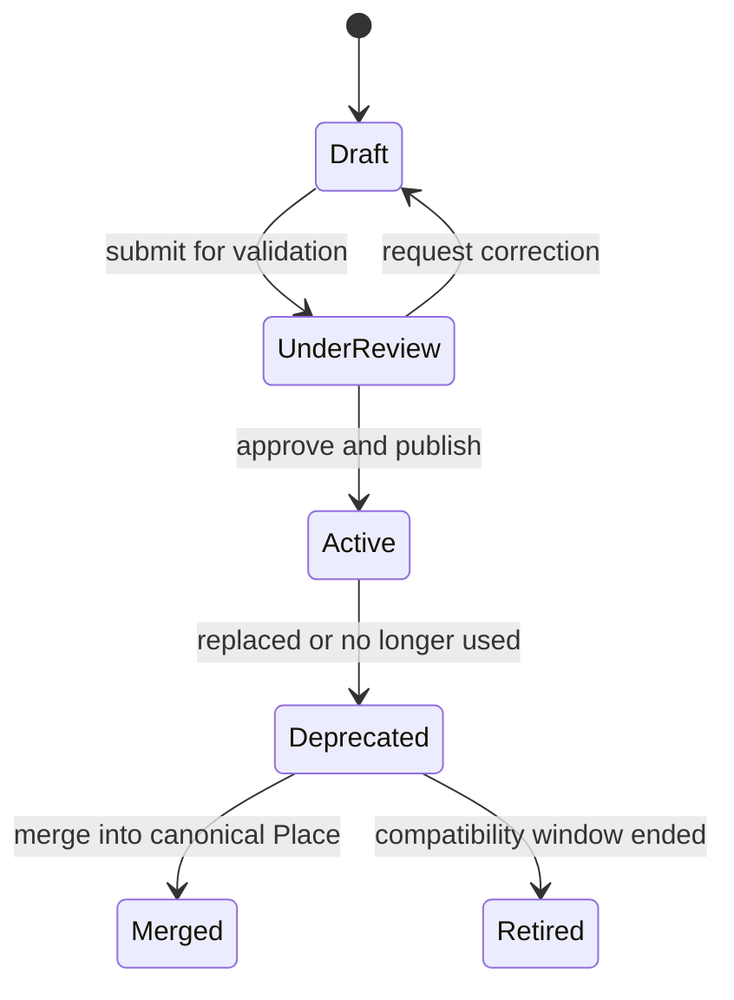
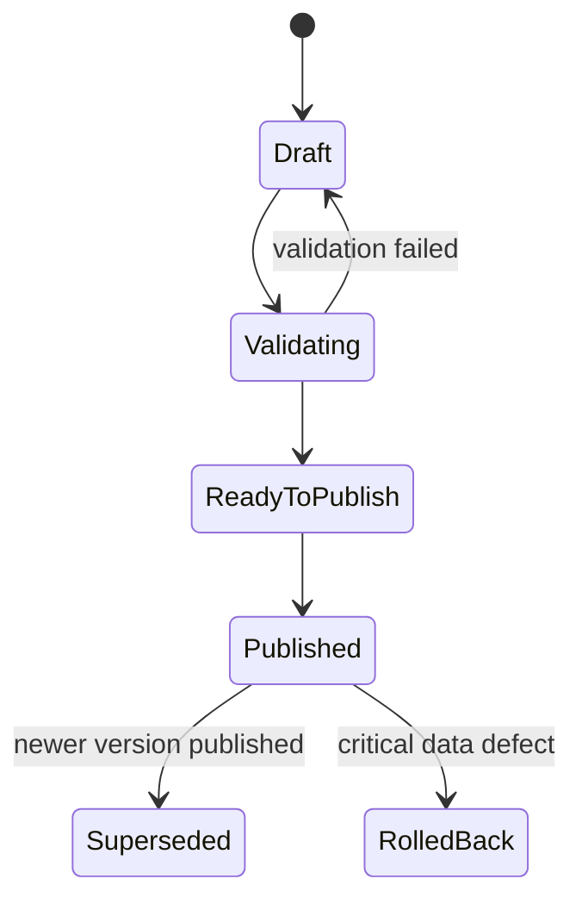
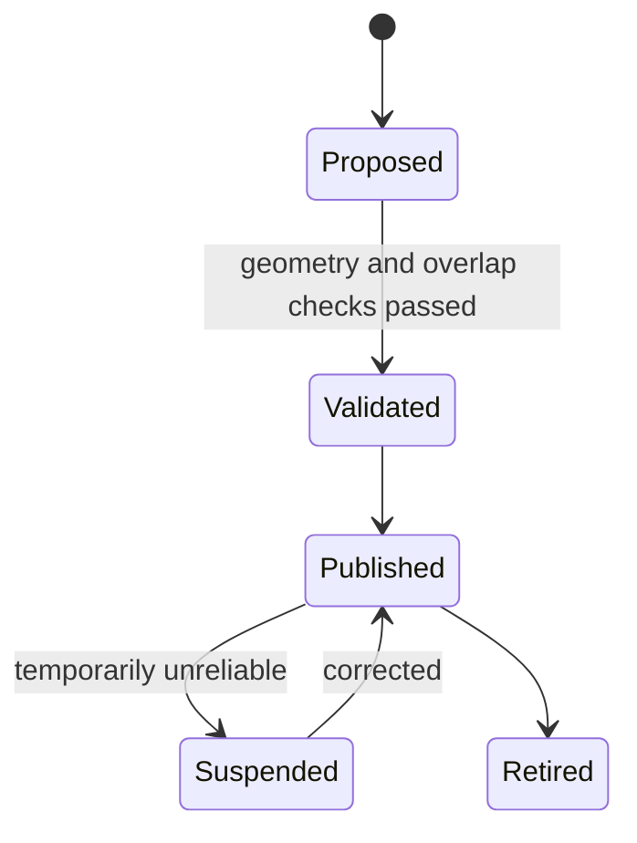

# Place & Network Domain Design

## Metadata

| Field | Value |
|---|---|
| Domain | Place & Network |
| Status | accepted-ddd-baseline |
| Owner Agent | agentm-place-network |
| Last Updated | 2026-06-28 |
| High-Level Inputs | `docs/01-ddd-high-level/domain-glossary.md`, `docs/01-ddd-high-level/context-map.md`, `docs/01-ddd-high-level/general-travel-ddd.md` |

## 1. 领域目标

Place & Network 负责出行平台中“地点”和“地点之间可达关系”的权威建模。它把城市、地址、Station、Airport、Port、Terminal、Platform、Gate、候车点、上车点、TransferNode、步行路径、接驳路径、GeoFence、别名和供应商地点码统一为可被其他上下文引用的 Place Graph。

它是独立边界的原因是：地点网络变化频率、数据来源、质量规则和业务风险都不同于班次、库存和订单。Trip Planning 需要稳定的地点图来搜索 Itinerary；Service Plan 需要把班次停靠点绑定到标准 Transport Node；Fulfillment 需要识别用户是否到达正确 Gate、Platform 或上车 GeoFence；Provider Integration 需要把外部地点码翻译为平台 PlaceId。Place & Network 只回答“在哪里、属于哪个层级、怎样从一个节点到另一个节点、转换需要什么约束”，不回答“哪趟车可售、多少钱、是否出票”。

## 2. 边界

### In Scope

- Place 的主数据：国家、地区、城市、行政区、地址、POI、Station、Airport、Port、大巴站、上车点、候车点。
- Transport Node 层级：Station/Terminal/Platform/Gate/Port Terminal/Boarding Point/TransferNode 的父子关系和可见范围。
- NetworkEdge：站内步行、站外步行、接驳车、摆渡车、换航站楼、换码头、跨站通勤等边。
- GeoFence：车站、机场、港口、上车点、换乘区、检票区、登乘区的地理围栏与有效版本。
- 最短换乘时间输入：不同节点、方向、交通方式、无障碍条件、行李条件、安全检查条件下的时间基线。
- 无障碍和可达性属性：电梯、坡道、轮椅通道、步行距离、楼层切换、夜间关闭、携带大件行李限制。
- 别名和供应商地点码映射：站名别名、多语言名、历史名、供应商站码、航司机场码、港口码、大巴上车点码。
- Place Graph 版本发布：草稿、验证、发布、弃用、回滚和兼容期。
- 地点合并、拆分、迁移和替代关系，用于搜索、订单展示、履约导航和历史数据解释。

### Out of Scope

- Service Plan 的班次、航班、船班、运营日历、经停时刻和停售规则。
- Trip Planning 的搜索策略、排序、组合算法、Itinerary 生成和风险打分最终决策。
- Capacity & Availability 的库存、座席、舱位、司机供给、配额和 Hold。
- Fare & Pricing 的票价、税费、手续费、优惠和退改规则。
- Booking Orchestration 的预订 Saga、供应商确认和补偿编排。
- Entitlement & Ticketing 的票号、登机牌、乘车码和凭证生命周期。
- Fulfillment 的检票、登机、登船、上车核验事实；本域只提供地点和 GeoFence 输入。
- Disruption Recovery 的异常恢复方案；本域只提供受影响节点和替代节点关系。

## 3. 统一语言补充

| Term | Definition | Notes |
|---|---|---|
| Place | 可被用户、供应商或系统引用的地点抽象。 | 可以是城市、地址、POI 或 Transport Node。 |
| Transport Node | 具有出行履约含义的 Place。 | Station、Airport、Port、大巴站、上车点均属于此类。 |
| Station | 铁路或大巴等固定班次的站点。 | 不直接包含车次时刻。 |
| Airport | 航空机场节点。 | 可包含多个 Terminal、Gate、安检区。 |
| Port | 轮船港口节点。 | 可包含码头、车辆登船区和安检区。 |
| Terminal | Station、Airport 或 Port 内的候乘或办理区域。 | 航站楼、站房、码头楼均可建模为 Terminal。 |
| Platform | 乘车或登船的站台、月台、泊位。 | Platform 变化通常来自运营或履约事件。 |
| Gate | 登机口、检票口、登船口或站内闸口。 | 可作为 Fulfillment 核验和提醒的展示输入。 |
| TransferNode | 用于换乘计算的抽象节点。 | 可是出口、通道、电梯、接驳点、出租车上车区。 |
| NetworkEdge | 两个节点之间的可达边。 | 带距离、时间、方式、限制和有效版本。 |
| GeoFence | 地理围栏。 | 用于定位、提醒、履约辅助，不替代核验事实。 |
| Place Alias | Place 的别名、多语言名或历史名。 | 用于搜索召回和供应商字段清洗。 |
| Provider Place Code | 供应商侧地点编码。 | 通过 ACL 映射为 PlaceId，不能泄漏到核心域。 |
| Place Graph Version | 一次发布后的地点网络快照版本。 | 下游读模型必须声明使用的版本。 |
| Accessibility Profile | 节点或边的无障碍能力集合。 | 影响最短换乘时间和方案可用性。 |
| Transfer Constraint | 换乘边或节点上的限制条件。 | 包括时间窗、安检、行李、出入境、夜间关闭。 |

## 4. 上下游契约

### Upstream

| Upstream Context | Consumed Contract | Reason |
|---|---|---|
| Provider Integration | ProviderPlaceImported、ProviderPlaceCodeMapped | 接收供应商地点码、名称、经纬度和层级建议，经防腐后进入映射流程。 |
| Admin & Audit | ApprovePlaceGraphRelease、CorrectPlaceData | 管理员审批高风险地点变更并记录审计。 |
| Supplier Catalog | CarrierStationScope、SupplierLocationScope | 判断某供应商或承运商可使用哪些节点和地点码。 |
| External GIS/Map Data | GeoCoordinate、BoundaryPolygon、WalkingPath | 提供地图底图、POI、步行距离和围栏候选数据。 |
| Fulfillment | NodeUsageObserved、GeoFenceHitObserved | 用实际到达和核验数据反哺地点质量，但不反向改履约状态。 |
| Customer Service | PlaceCorrectionRequested | 用户或客服发现站名、入口、上车点错误时发起修正。 |

### Downstream

| Downstream Context | Published Contract | Reason |
|---|---|---|
| Trip Planning | PlaceGraphSnapshot、TransportNode、NetworkEdge、TransferConstraint | 方案搜索、多方式换乘和首末段接驳依赖地点网络。 |
| Service Plan | StandardStop、NodeBinding、PlaceGraphVersion | 班次停靠点必须绑定标准 Stop 或 Station。 |
| Transfer Management | TransferNodeGraph、MinimumConnectionTimeInput、AccessibilityProfile | 中转风险评估需要站内/站外路径和限制。 |
| Offer Management | PlaceRiskNotice、SelfTransferDisclosureInput | 报价展示中转风险、换站说明和无障碍限制。 |
| Fulfillment | GeoFencePublished、BoardingLocationSnapshot | 到达提醒、检票区提示和上车点展示依赖位置快照。 |
| Disruption Recovery | AlternativePlaceRelation、NearbyNodeIndex | 异常时查找邻近 Station、Airport、Port 或替代上车点。 |
| Reporting | PlaceQualityReadModel、NodeUsageMetrics | 监控地点匹配准确率、别名命中和履约偏差。 |

## 5. 聚合设计

| Aggregate Root | Invariants | Commands | Events |
|---|---|---|---|
| Place | PlaceId 全局唯一；类型变更必须保留历史语义；经纬度和行政层级在同一版本内一致；合并后旧 PlaceId 只能指向 canonical Place。 | CreatePlace、RenamePlace、MovePlace、MergePlaces、SplitPlace、DeprecatePlace | PlaceCreated、PlaceRenamed、PlaceMoved、PlacesMerged、PlaceSplit、PlaceDeprecated |
| Stop | Stop 必须绑定一个 Place；同一供应商地点码在同一有效期内只能映射到一个 Stop；Stop 可服务的 TransportMode 必须明确。 | RegisterStop、BindProviderStopCode、UnbindProviderStopCode、ChangeStopServingMode | StopRegistered、ProviderStopCodeBound、ProviderStopCodeUnbound、StopServingModeChanged |
| NodeHierarchy | 子节点不能形成环；Terminal、Platform、Gate 必须隶属于可达的父 Transport Node；层级变更必须有生效时间。 | AddChildNode、MoveChildNode、CloseNodeTemporarily、ReopenNode | ChildNodeAdded、ChildNodeMoved、NodeTemporarilyClosed、NodeReopened |
| NetworkGraph | NetworkEdge 两端必须是已发布节点；边的方向、方式、时间、距离和限制不可缺失；同一版本发布后不可原地修改。 | AddNetworkEdge、UpdateNetworkEdgeDraft、RetireNetworkEdge、PublishNetworkGraphVersion | NetworkEdgeAdded、NetworkEdgeDraftUpdated、NetworkEdgeRetired、NetworkGraphVersionPublished |
| GeoFenceSet | GeoFence 必须绑定 Place 或 TransferNode；多边形必须合法闭合；版本发布后只追加新版本不覆盖旧版本。 | DefineGeoFence、ValidateGeoFence、PublishGeoFenceVersion、RetireGeoFence | GeoFenceDefined、GeoFenceValidated、GeoFenceVersionPublished、GeoFenceRetired |
| AliasMapping | Alias 归属语言、来源、置信度和有效期必须明确；高冲突别名不得自动发布。 | ProposeAlias、ApproveAlias、RejectAlias、PromoteAliasToCanonical | AliasProposed、AliasApproved、AliasRejected、AliasPromotedToCanonical |
| PlaceGraphRelease | 发布必须引用已验证的 Place、NodeHierarchy、NetworkGraph 和 GeoFenceSet；发布版本可回滚但不能删除历史版本。 | CreateReleaseCandidate、ValidateReleaseCandidate、PublishPlaceGraph、RollbackPlaceGraph | ReleaseCandidateCreated、ReleaseCandidateValidated、PlaceGraphPublished、PlaceGraphRolledBack |

## 6. 状态机

### Place 生命周期

Place 处于 Active 后才能被 Service Plan、Trip Planning 和 Fulfillment 正式引用。Deprecated 仍可被历史订单和供应商回放解析，Merged 必须保留 canonical PlaceId 映射。

### Place Graph Release 生命周期

Published 版本不可变；下游消费时必须记录 `placeGraphVersion`。回滚发布新版本表达，不修改历史 Published 快照。

### GeoFence 生命周期

Suspended 的 GeoFence 不用于自动履约判断，只用于人工提示或低置信度提醒。

## 7. 命令和领域事件

| Command | Aggregate | Event | Idempotency Key |
|---|---|---|---|
| CreatePlace | Place | PlaceCreated | `sourceSystem + sourcePlaceKey` |
| RenamePlace | Place | PlaceRenamed | `placeId + nameVersion` |
| MergePlaces | Place | PlacesMerged | `canonicalPlaceId + mergedPlaceIdsHash` |
| SplitPlace | Place | PlaceSplit | `originalPlaceId + splitRequestId` |
| RegisterStop | Stop | StopRegistered | `transportMode + canonicalCode` |
| BindProviderStopCode | Stop | ProviderStopCodeBound | `providerId + providerPlaceCode + validFrom` |
| AddChildNode | NodeHierarchy | ChildNodeAdded | `parentNodeId + childNodeId + validFrom` |
| MoveChildNode | NodeHierarchy | ChildNodeMoved | `childNodeId + newParentId + validFrom` |
| AddNetworkEdge | NetworkGraph | NetworkEdgeAdded | `fromNodeId + toNodeId + edgeMode + validFrom` |
| RetireNetworkEdge | NetworkGraph | NetworkEdgeRetired | `edgeId + retireReason + validTo` |
| DefineGeoFence | GeoFenceSet | GeoFenceDefined | `placeId + geometryHash + sourceSystem` |
| PublishGeoFenceVersion | GeoFenceSet | GeoFenceVersionPublished | `geoFenceSetId + version` |
| ProposeAlias | AliasMapping | AliasProposed | `normalizedAlias + locale + sourceSystem` |
| ApproveAlias | AliasMapping | AliasApproved | `aliasId + approverId + decisionTime` |
| CreateReleaseCandidate | PlaceGraphRelease | ReleaseCandidateCreated | `releaseName + sourceSnapshotHash` |
| PublishPlaceGraph | PlaceGraphRelease | PlaceGraphPublished | `releaseCandidateId + publishWindow` |
| RollbackPlaceGraph | PlaceGraphRelease | PlaceGraphRolledBack | `publishedVersion + rollbackRequestId` |

## 8. 策略和 Saga 参与点

- 当 Provider Integration 发布 `ProviderPlaceImported` 时，本域先进入 AliasMapping 和 Provider Place Code 映射流程；低冲突、高置信度数据可自动创建 Draft Place，高冲突数据必须进入人工审核。
- 当 Service Plan 绑定未知 Stop 时，本域返回标准化失败原因：未知地点、供应商码冲突、层级缺失、版本未发布。Service Plan 可暂存原始计划，但不能把未知 Stop 发布给 Trip Planning。
- 当 Fulfillment 产生大量 `GeoFenceHitObserved` 与预期节点偏离时，本域创建地点质量告警，可能触发 GeoFence Suspended 或新版本修正。
- 当 Disruption Recovery 请求替代地点时，本域只提供邻近节点、同城替代、同供应商可用范围和可达边，不选择恢复方案。
- 当 Admin & Audit 审批高风险发布时，本域执行 PlaceGraph 发布 Saga：校验层级、边连通性、供应商码唯一性、GeoFence 合法性、下游兼容影响，最后发布 `PlaceGraphPublished`。
- 当 Place 合并或拆分影响历史订单展示时，本域发布兼容映射；Journey Order 和 Customer Service 保持历史 PlaceId 可解释，不重写订单事实。

## 9. 读模型

| Read Model | Source Events | Consumers |
|---|---|---|
| PlaceSearchIndex | PlaceCreated、PlaceRenamed、AliasApproved、PlacesMerged | Trip Planning、用户搜索、客服搜索 |
| TransportNodeDirectory | StopRegistered、ChildNodeAdded、ChildNodeMoved、StopServingModeChanged | Service Plan、Trip Planning、Admin |
| PlaceGraphSnapshot | PlaceGraphPublished、NetworkEdgeAdded、NetworkEdgeRetired | Trip Planning、Transfer Management、Offer Management |
| MinimumConnectionTimeMatrix | NetworkEdgeAdded、NetworkEdgeDraftUpdated、AccessibilityProfileChanged | Transfer Management、Trip Planning |
| GeoFenceLookup | GeoFenceVersionPublished、GeoFenceRetired、GeoFenceSuspended | Fulfillment、Notification、Dispatch |
| ProviderCodeMappingIndex | ProviderStopCodeBound、ProviderStopCodeUnbound、PlacesMerged | Provider Integration、Service Plan、Capacity |
| AccessibilityMap | ChildNodeAdded、NetworkEdgeAdded、NodeTemporarilyClosed、NodeReopened | Trip Planning、Ancillary Service、Customer Service |
| NearbyAlternativePlaceIndex | PlaceMoved、NetworkEdgeAdded、AlternativeRelationChanged | Disruption Recovery、Trip Planning、Customer Service |
| PlaceQualityDashboard | AliasRejected、GeoFenceHitObserved、PlaceCorrectionRequested | Admin & Audit、Reporting、数据运营 |
| HistoricalPlaceResolution | PlacesMerged、PlaceDeprecated、PlaceGraphRolledBack | Journey Order、Customer Service、Finance Settlement |

## 10. 外部系统和防腐层

Place & Network 需要强防腐层，因为外部地点语言高度不一致：铁路站码、IATA/ICAO 机场码、航司自有码、港口 UN/LOCODE、船司码、大巴站点码、网约车 POI、地图商 POI、行政区划码都不能直接成为平台核心模型。

防腐层规则：

1. 所有外部地点标识必须先进入 `ProviderPlaceCode`，再映射到平台 PlaceId 或 StopId。
2. Provider Place Code 映射必须包含 providerId、sourceSystem、rawCode、rawName、validFrom、validTo、confidence 和冲突状态。
3. 外部坐标只作为候选值；Active Place 的坐标和 GeoFence 必须经过几何校验、层级校验和发布流程。
4. 同名不同地、同码变更、站点搬迁、临时上车点必须显式建模，不允许以字符串覆盖。
5. 下游契约只暴露 PlaceId、StopId、nodeId、placeGraphVersion 和标准名称；供应商原始码仅在 Provider Integration 或诊断视图中可见。
6. 地图商步行路径、道路状态和 POI 名称可用于 NetworkEdge 候选生成，但路径发布必须转化为平台 NetworkEdge 和 Transfer Constraint。
7. 对无障碍数据，外部来源必须标注置信度和更新时间；影响中转可达性的低置信度信息要在 Offer 展示为风险说明输入。

## 11. 当前服务迁移影响

| Current Service | Migration Impact |
|---|---|
| 车站基础数据表 | 迁移为 Place、Stop、NodeHierarchy；保留原站码到 StopId 的映射，历史订单通过 HistoricalPlaceResolution 查询。 |
| 城市和站点搜索接口 | 改为读取 PlaceSearchIndex，支持别名、多语言、拼音、供应商码召回和 canonical Place 去重。 |
| 车次经停数据导入 | Service Plan 导入前必须调用 ProviderCodeMappingIndex；未知站点进入映射队列而不是直接落库。 |
| 订单展示中的出发到达站字段 | 新订单存 PlaceId/StopId 快照和展示名；旧订单通过兼容映射补全标准地点信息。 |
| 检票口或候车室展示字段 | 建模为 Gate、Platform 或 Terminal 的 NodeHierarchy 子节点；短期可作为低置信度节点属性导入。 |
| 网约车上车点或接驳点 | 迁移为 Place + GeoFence + TransferNode，避免把地址字符串直接传给 Trip Planning。 |
| 后台站点维护页面 | 拆分为 Place 编辑、供应商码映射、GeoFence 编辑、NetworkEdge 编辑和发布审批。 |
| 搜索缓存和推荐邻近站逻辑 | 改为消费 PlaceGraphSnapshot 和 NearbyAlternativePlaceIndex，缓存键增加 placeGraphVersion。 |
| 数据质量脚本 | 升级为发布前校验：孤立节点、环形层级、重复供应商码、GeoFence 交叠、边不可达。 |

## 12. 验收标准

- 本 domain 的聚合所有权明确：Place、Stop、NodeHierarchy、NetworkGraph、GeoFenceSet、AliasMapping、PlaceGraphRelease 均由 Place & Network 拥有。
- 本 domain 明确不拥有 Service Plan 班次时刻、Trip Planning 搜索策略、Capacity 库存、Fulfillment 核验和订单状态。
- Place、Stop、Station、Airport、Port、Terminal、Platform、Gate、TransferNode、NetworkEdge、GeoFence 等术语在文档内语义一致。
- multimodal 换乘、站内/站外换乘时间、可达性、无障碍、地理层级、别名和供应商地点码防腐均有建模位置。
- Place Graph 版本发布、回滚、兼容期和下游 `placeGraphVersion` 传递规则明确。
- 命令和事件均为可幂等处理的领域契约，事件使用过去式业务事实。
- 状态机只描述本域对象生命周期，不定义 Transfer Management、Service Plan、Fulfillment 或订单状态。
- 读模型覆盖搜索、节点目录、地点图快照、换乘时间矩阵、GeoFence 查询、供应商码映射、无障碍地图和历史解析。
- 外部系统通过 ACL 进入本域，供应商原始地点码不会污染核心模型或跨域契约。
- 当前服务迁移影响包含旧站点表、搜索接口、经停导入、订单展示、后台维护和数据质量脚本。
