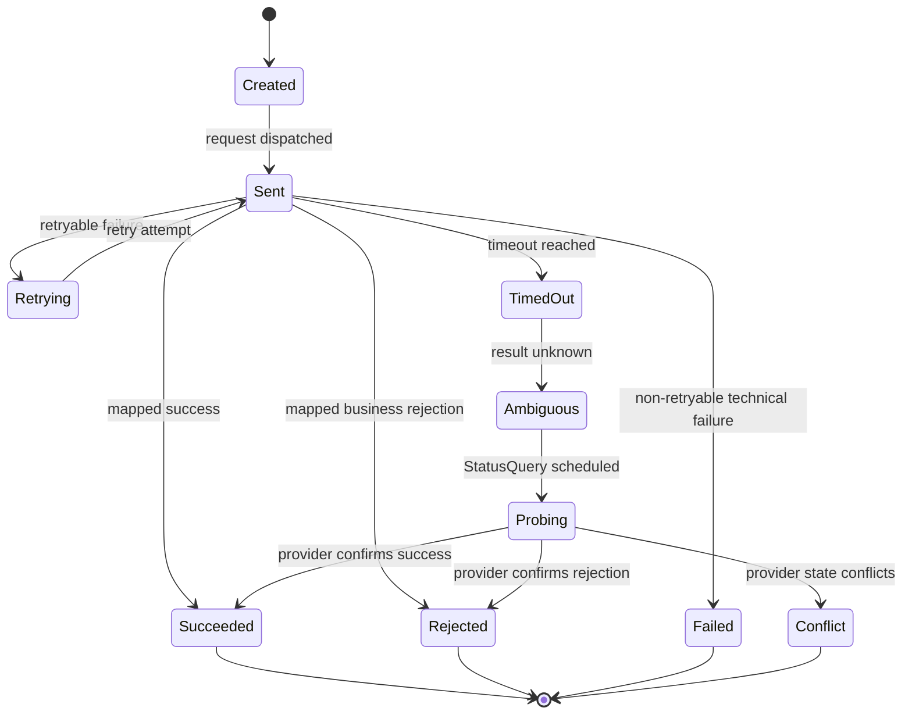
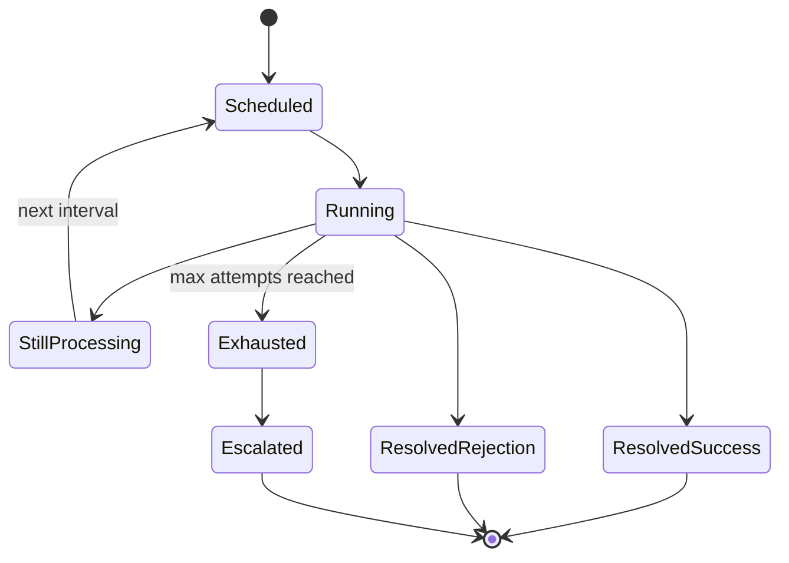
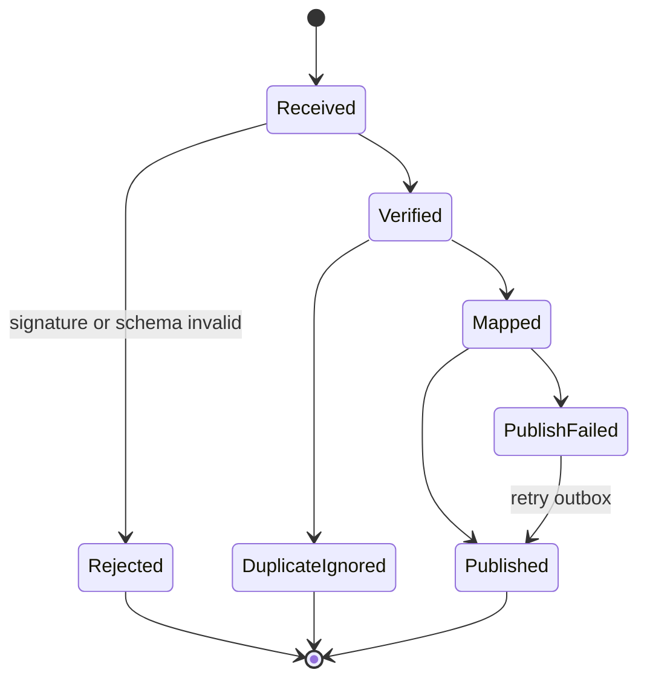

# Provider Integration Domain Design

## Metadata

| Field | Value |
|---|---|
| Domain | Provider Integration |
| Status | accepted-ddd-baseline |
| Owner Agent | agentm-provider-integration |
| Last Updated | 2026-06-28 |
| High-Level Inputs | `docs/01-ddd-high-level/context-map.md`, `docs/01-ddd-high-level/acl-provider-contracts.md`, `docs/01-ddd-high-level/general-travel-ddd.md` |

## 1. 领域目标

Provider Integration 是 General Travel 平台面向外部供应商的防腐层。它把铁路、航司、大巴、船司、网约车、支付渠道、保险、行李、餐饮等外部 API 的语言转换为平台可消费的 ProviderContract，并把外部状态、错误、回调、账单和查询结果转换为稳定事件或结果。

本 domain 独立存在的原因是外部供应商具有高度异构性：对象名、状态机、错误码、限流策略、回调可靠性、幂等规则、查询接口和账单口径都不一致。如果这些差异直接进入 JourneyOrder、Booking、Fare、Capacity、Entitlement、Payment 或 PostSales，核心域会被供应商语言污染，后续每接入一个供应商都会扩散修改。

Provider Integration 的目标是：

1. 对内提供统一的 ProviderAdapter 与 ProviderContract。
2. 对外封装认证、签名、SLA、限流、熔断、Retry、Timeout、StatusQuery、Webhook 和对账输入。
3. 保留 raw request、raw response、raw status 和 raw error 以支持审计、客服、回放和供应商争议。
4. 通过 ACL 把供应商结果映射成平台领域事件或标准结果，不拥有核心业务语义。
5. 用 Capability Matrix 显式表达每个供应商支持哪些能力，避免编排流程假设所有供应商能力一致。

## 2. 边界

### In Scope

- ProviderAdapter 注册、版本、启停、健康状态和能力声明。
- ProviderContract 的请求、响应、错误、状态和事件映射。
- 供应商认证、签名、加解密、报文格式转换和协议适配。
- Idempotency、Retry、Timeout、StatusQuery、限流、熔断和降级策略执行。
- ProviderRequestLog、ProviderStatusProbe、WebhookInbox、Outbox/Inbox 的一致性记录。
- 外部 Webhook 验签、去重、排序、幂等消费和事件转换。
- 供应商对账文件、账单、状态快照和差异检测的输入归一。
- SLA 指标采集：成功率、超时率、重试率、延迟、回调延迟、状态不一致率。
- 支付和附加服务供应商的接口防腐；支付资金语义仍归 Payment。

### Out of Scope

- 不创建、取消或结算 JourneyOrder；只返回供应商交互结果。
- 不决定 Booking 的业务流程、补偿策略和多段 Saga；这些属于 Booking Orchestration。
- 不拥有 Fare、价格、税费、手续费、退改规则和 Offer 有效期语义。
- 不拥有 Capacity 与 Availability 的库存不变量；只查询或回传外部可用性结果。
- 不拥有 Entitlement 生命周期；只把票号、PNR、乘车码、保单号等供应商引用转换为凭证输入。
- 不拥有 Payment 资金状态；只处理支付渠道 API 的 ACL、回调验签和账单输入。
- 不拥有 PostSales 规则；只执行供应商退改取消能力并返回结果。
- 不向用户直接展示供应商原始错误文案；面向用户的文案由对应业务上下文或 Notification 决定。

## 3. 统一语言补充

| Term | Definition | Notes |
|---|---|---|
| ProviderAdapter | 某个供应商或渠道的协议适配实现，负责请求转换、响应解析和 raw 数据保留。 | Adapter 必须声明版本和 Capability Matrix。 |
| ProviderContract | 平台对内暴露的统一供应商契约，包括 command、result、error、status 和 event。 | Booking、Capacity、Payment、PostSales 等只依赖该契约。 |
| Capability Matrix | 描述供应商支持的能力、是否同步返回、是否支持查询、是否支持 Webhook 和 SLA 限制。 | 编排流程按能力选择路径。 |
| ProviderRequestLog | 一次外部调用的权威交互日志，包含幂等键、请求、响应、状态和重试链路。 | 不作为业务状态机来源。 |
| ProviderStatusProbe | 针对 AmbiguousResult、Timeout 或对账差异发起的状态查询任务。 | StatusQuery 的聚合根。 |
| WebhookInbox | 外部回调进入平台后的验签、去重、排序和消费记录。 | 防止重复回调重复推进业务。 |
| ProviderReference | 供应商侧确认号、PNR、票号、派单号、保单号、支付渠道流水号等。 | 不是平台订单号。 |
| AmbiguousResult | 外部调用超时、断连或响应不可判定，无法确认供应商是否已执行。 | 禁止盲目重放创建类请求，必须 StatusQuery。 |
| ProviderStateConflict | 供应商状态与平台投影不一致。 | 输出给 Customer Service、Finance Settlement 或恢复流程。 |
| Outbox/Inbox | 对内发布事件和对外接收事件的可靠消息模式。 | 保证转换后的事件至少一次投递并幂等消费。 |

## 4. 上下游契约

### Upstream

| Upstream Context | Consumed Contract | Reason |
|---|---|---|
| Supplier Catalog | ProviderProfile、CredentialProfile、ContractProfile、CapabilityBaseline | 获取供应商身份、认证材料、合作合同、基础能力和启停配置。 |
| Booking Orchestration | ReserveWithProvider、ConfirmProviderReservation、CancelProviderReservation、QueryProviderReservation | 编排上下文发起供应商预留、确认、取消和查询。 |
| Capacity & Availability | SearchProviderAvailability、SubscribeProviderInventoryFeed | 外部库存和可用性查询需要走 ACL。 |
| Fare & Pricing | QueryProviderFare、FetchProviderRuleSnapshot | 外部价格、税费、票规和规则快照需归一后再进入定价。 |
| Entitlement & Ticketing | IssueProviderCredential、VoidProviderCredential、QueryProviderCredential | 出票、作废、补发凭证等操作需适配供应商接口。 |
| Post Sales | ChangeProviderReservation、RefundOrCancelWithProvider、QueryProviderAfterSales | 退改取消执行依赖供应商能力，但规则不在本域。 |
| Payment | AuthorizeChannel、CaptureChannel、RefundChannel、QueryChannelPayment | 支付渠道也是外部 Provider，但资金状态归 Payment。 |
| Ancillary Service | ReserveAncillaryProvider、CancelAncillaryProvider、IssueAncillaryCredential | 保险、行李、餐饮、接送等供应商接入复用 ACL。 |
| Admin & Audit | EnableProviderAdapter、DisableProviderAdapter、OverrideProviderLimit | 高风险运维操作需要审计和权限控制。 |

### Downstream

| Downstream Context | Published Contract | Reason |
|---|---|---|
| Booking Orchestration | ProviderReservationSucceeded、ProviderReservationPending、ProviderReservationRejected、ProviderResultAmbiguous | 编排根据供应商结果推进或补偿。 |
| Capacity & Availability | ProviderAvailabilitySnapshot、ProviderInventoryChanged | 外部可用性变化进入库存读模型或同步流程。 |
| Fare & Pricing | ProviderFareQuoted、ProviderRuleChanged | 价格和规则变化由定价上下文解释。 |
| Entitlement & Ticketing | ProviderCredentialIssued、ProviderCredentialVoided、ProviderCredentialSuspended | 凭证上下文决定票证生命周期。 |
| Payment | ChannelPaymentAuthorized、ChannelPaymentCaptured、ChannelRefundSettled、ChannelPaymentAmbiguous | Payment 根据渠道结果推进资金聚合。 |
| Post Sales | ProviderAfterSalesSucceeded、ProviderAfterSalesRejected、ProviderAfterSalesAmbiguous | 售后编排根据供应商执行结果继续处理。 |
| Disruption Recovery | ProviderDisruptionPublished | 外部延误、取消、停运、封航、司机取消转成异常输入。 |
| Finance Settlement | ProviderReconciliationInput、ProviderSettlementFileImported、ProviderStateConflictDetected | 对账和清算消费归一后的输入。 |
| Customer Service | ProviderInteractionTimeline、ProviderStateConflictCase | 客服查看供应商交互事实，不直接改供应商状态。 |
| Reporting | ProviderSlaSnapshot、ProviderCapabilitySnapshot | 运营监控和供应商绩效评估。 |

## 5. 聚合设计

| Aggregate Root | Invariants | Commands | Events |
|---|---|---|---|
| ProviderAdapter | 同一 providerId + adapterVersion 唯一；启用前必须有认证配置、能力矩阵和健康检查策略；停用后不得接受新 command。 | RegisterProviderAdapter、EnableProviderAdapter、DisableProviderAdapter、UpdateCapabilityMatrix、UpdateSlaPolicy | ProviderAdapterRegistered、ProviderAdapterEnabled、CapabilityMatrixUpdated、ProviderAdapterDisabled |
| ProviderRequestLog | 同一 providerId + operation + idempotencyKey 对应唯一外部意图；创建类请求在 AmbiguousResult 前不得重复发起新外部意图；raw 数据不可被业务改写。 | RecordProviderRequest、RecordProviderResponse、MarkProviderTimeout、AttachRetryAttempt、MarkProviderOutcome | ProviderRequestRecorded、ProviderResponseRecorded、ProviderRequestTimedOut、ProviderOutcomeMapped |
| ProviderStatusProbe | 一个 probe 只查询一个 providerReference 或 idempotencyKey；达到终态后不能继续自动查询；查询间隔必须符合限流策略。 | ScheduleStatusProbe、ExecuteStatusQuery、CompleteStatusProbe、EscalateStatusProbe | ProviderStatusProbeScheduled、ProviderStatusProbeCompleted、ProviderStatusProbeEscalated |
| WebhookInbox | Webhook 先验签再入库；同一 providerId + eventId + signature scope 幂等；未完成映射前不得发布业务事件。 | ReceiveWebhook、VerifyWebhook、MapWebhookEvent、RejectWebhook、ReplayWebhook | WebhookReceived、WebhookVerified、WebhookMapped、WebhookRejected |
| ProviderOutbox | 仅发布已完成映射的平台事件；同一 sourceLogId + mappedEventType 幂等；发布失败可重试但事件内容不可变。 | EnqueueMappedEvent、PublishMappedEvent、MarkOutboxDelivered、MarkOutboxFailed | ProviderEventEnqueued、ProviderEventPublished、ProviderEventDeliveryFailed |
| ProviderReconciliationBatch | 同一 providerId + statementPeriod + fileHash 不重复导入；差异只能生成输入或 Case，不能直接修业务聚合。 | ImportProviderStatement、MatchProviderRecords、EmitReconciliationInput、RaiseProviderStateConflict | ProviderStatementImported、ProviderReconciliationInputEmitted、ProviderStateConflictDetected |

## 6. 状态机

### ProviderRequestLog 状态机

状态说明：Succeeded、Rejected、Failed、Conflict 是 Provider Integration 自己的调用结果状态，不等于 JourneyOrder、Booking、Payment 或 Entitlement 的业务状态。

### ProviderStatusProbe 状态机

### WebhookInbox 状态机

## 7. 命令和领域事件

| Command | Aggregate | Event | Idempotency Key |
|---|---|---|---|
| RegisterProviderAdapter | ProviderAdapter | ProviderAdapterRegistered | providerId + adapterVersion |
| UpdateCapabilityMatrix | ProviderAdapter | CapabilityMatrixUpdated | providerId + matrixVersion |
| ReserveWithProvider | ProviderRequestLog | ProviderRequestRecorded、ProviderOutcomeMapped | segmentBookingId + providerId + reserveAttemptNo |
| ConfirmProviderReservation | ProviderRequestLog | ProviderOutcomeMapped | segmentBookingId + providerReference + confirmAttemptNo |
| CancelProviderReservation | ProviderRequestLog | ProviderOutcomeMapped | segmentBookingId + providerReference + cancelAttemptNo |
| IssueProviderCredential | ProviderRequestLog | ProviderOutcomeMapped | entitlementId + providerId + issueAttemptNo |
| VoidProviderCredential | ProviderRequestLog | ProviderOutcomeMapped | entitlementId + providerReference + voidAttemptNo |
| AuthorizeChannel | ProviderRequestLog | ProviderOutcomeMapped | paymentIntentId + channelId + authAttemptNo |
| RefundChannel | ProviderRequestLog | ProviderOutcomeMapped | refundId + channelId + refundAttemptNo |
| ScheduleStatusProbe | ProviderStatusProbe | ProviderStatusProbeScheduled | sourceLogId + probePurpose |
| ExecuteStatusQuery | ProviderStatusProbe | ProviderStatusProbeCompleted 或 ProviderStatusProbeEscalated | probeId + attemptNo |
| ReceiveWebhook | WebhookInbox | WebhookReceived | providerId + webhookEventId |
| MapWebhookEvent | WebhookInbox | WebhookMapped | inboxId + mappedEventType |
| ImportProviderStatement | ProviderReconciliationBatch | ProviderStatementImported | providerId + statementPeriod + fileHash |
| MatchProviderRecords | ProviderReconciliationBatch | ProviderReconciliationInputEmitted 或 ProviderStateConflictDetected | reconciliationBatchId + recordKey |

## 8. 策略和 Saga 参与点

- Idempotency 策略：平台为每个外部意图生成幂等键。供应商支持幂等键时透传；不支持时由 ProviderRequestLog 以 providerId、operation、businessRef 和 request fingerprint 防重复。
- Retry 策略：只对 RetryableTechnicalError 和明确安全的查询类操作自动重试；创建、出票、扣款、退款等有副作用操作在 Timeout 后进入 AmbiguousResult，不直接重放。
- Timeout 策略：每个 operation 有 connect timeout、read timeout、business timeout 和 finalization timeout；超过 business timeout 后发布 ProviderResultAmbiguous 并安排 StatusQuery。
- StatusQuery 策略：优先按 providerReference 查询；没有 providerReference 时按供应商幂等键、业务引用或请求流水查询；查询耗尽后升级为 ProviderStateConflict 或人工 Case 输入。
- Webhook 策略：Webhook 只作为外部事实输入，必须验签、幂等和映射；晚到 Webhook 不直接推进业务聚合，而是发布带 causationId 的 mapped event，由下游判断是否仍可接受。
- Outbox/Inbox 策略：Provider Integration 使用 Inbox 接收外部回调，使用 Outbox 发布平台事件；两边均要求幂等、可重放、可观测。
- 限流和熔断策略：按 providerId、operation、credential、region、transportMode 维度限流；错误率、超时率或供应商维护窗口触发熔断；熔断后对查询类可降级到缓存，对创建类返回暂不可用。
- SLA 策略：Capability Matrix 中记录 P95 latency、成功率、回调时效、最大并发、日配额和维护窗口；Trip Planning、Booking Orchestration 和 PostSales 可据此选择供应商或降级路径。
- Saga 参与点：本域不拥有 Saga，只响应 Booking Orchestration、Payment、PostSales 等命令并返回 Provider outcome；补偿动作由上游 Saga 决定。

## 9. 读模型

| Read Model | Source Events | Consumers |
|---|---|---|
| Provider Capability Matrix View | ProviderAdapterRegistered、CapabilityMatrixUpdated、ProviderAdapterDisabled | Booking Orchestration、Capacity & Availability、Post Sales、Admin & Audit |
| Provider Interaction Timeline | ProviderRequestRecorded、ProviderResponseRecorded、ProviderRequestTimedOut、WebhookMapped、ProviderStatusProbeCompleted | Customer Service、Admin & Audit、Journey Order timeline 投影 |
| Provider SLA Dashboard | ProviderOutcomeMapped、ProviderRequestTimedOut、ProviderEventDeliveryFailed、WebhookReceived | Reporting、Supplier Catalog、运营团队 |
| Ambiguous Result Queue | ProviderRequestTimedOut、ProviderStatusProbeScheduled、ProviderStatusProbeEscalated | Booking Orchestration、Payment、Post Sales、Customer Service |
| Webhook Inbox Monitor | WebhookReceived、WebhookVerified、WebhookRejected、WebhookMapped | Provider Integration 运维、Admin & Audit |
| Reconciliation Input View | ProviderStatementImported、ProviderReconciliationInputEmitted、ProviderStateConflictDetected | Finance Settlement、Customer Service、Reporting |
| Provider Error Taxonomy View | ProviderOutcomeMapped、WebhookRejected、ProviderStateConflictDetected | ProviderAdapter 开发者、运营、供应商管理 |

## 10. 外部系统和防腐层

Provider Integration 自身就是外部系统防腐层。每个 ProviderAdapter 至少包含以下组件：

1. Auth Client：处理 token、证书、签名、密钥轮换和请求验签。
2. Request Mapper：把 ProviderContract command 转成供应商 DTO，不把平台内部聚合泄露给供应商。
3. Response Mapper：把供应商响应转成标准 outcome、ProviderReference、mappedStatus、errorType 和 nextAction。
4. Error Mapper：把供应商错误码归类为 BusinessRejected、RetryableTechnicalError、NonRetryableTechnicalError、AmbiguousResult、ProviderRuleChanged 或 ProviderStateConflict。
5. Status Mapper：把 PNR、ticketed、assigned、cancelled、refund_success、driver_cancelled 等外部状态映射为平台事件输入。
6. Capability Descriptor：声明 SearchAvailability、QuoteProviderOffer、Reserve、Confirm、Issue、Change、Cancel、QueryStatus、Webhook、ReconcileSettlement 等能力。
7. Resilience Policy：定义 Retry、Timeout、限流、熔断、隔离舱和维护窗口。
8. Raw Archive：保存 raw request、raw response、raw webhook、签名摘要和报文版本，满足审计与供应商争议。

能力矩阵示例：

| Provider Type | Reserve | Confirm | Issue | Change | Cancel | StatusQuery | Webhook | ReconcileSettlement |
|---|---|---|---|---|---|---|---|---|
| Rail | yes | yes | yes | yes | yes | yes | sometimes | yes |
| Air | yes | sometimes | yes | yes | yes | yes | yes | yes |
| Coach | yes | sometimes | yes | sometimes | yes | yes | sometimes | yes |
| Ferry | yes | sometimes | yes | yes | yes | yes | sometimes | yes |
| RideHailing | yes | no | yes | no | yes | yes | yes | yes |
| Payment | yes | yes | no | no | yes | yes | yes | yes |
| Insurance | yes | no | yes | no | yes | yes | yes | yes |

典型 ACL 映射红线：PNR 不是 JourneyOrderId；票号不是 Entitlement 聚合状态；司机接单不是整单确认；支付渠道流水不是平台 PaymentIntent 状态；供应商退款成功不是 PostSales 规则完成。

## 11. 当前服务迁移影响

| Current Service | Migration Impact |
|---|---|
| train booking provider calls | 包装为 Rail ProviderAdapter；现有请求响应结构进入 raw archive，对内只暴露 ReserveWithProvider、IssueProviderCredential、CancelProviderReservation 等契约。 |
| train ticket status polling | 迁移为 ProviderStatusProbe；超时、出票中、退票中等状态按 AmbiguousResult 和 StatusQuery 处理。 |
| provider callback endpoint | 迁移为 WebhookInbox；新增验签、去重、schema version、mapping version 和 Outbox 发布。 |
| payment channel integration | 通道调用进入 Provider Integration ACL；Payment 只消费 ChannelPaymentAuthorized、ChannelPaymentCaptured、ChannelRefundSettled 等结果。 |
| refund and change supplier calls | 由 Post Sales 发命令，本域执行供应商取消、改签、退款接口并返回 ProviderAfterSales outcome。 |
| availability sync jobs | 迁移为 SearchProviderAvailability 或 ProviderInventoryChanged 输入；库存解释和可售判断留在 Capacity & Availability。 |
| settlement file import scripts | 迁移为 ProviderReconciliationBatch；只生成 ProviderReconciliationInput 和 ProviderStateConflictDetected，不直接修订单或资金。 |
| admin supplier switches | 迁移为 ProviderAdapter 启停和 Capability Matrix 版本变更；所有操作进入 Admin & Audit。 |
| logging and tracing | ProviderRequestLog 成为外部调用审计事实；traceId、correlationId、idempotencyKey 必须贯穿上下游。 |

## 12. 验收标准

- 本 domain 的聚合所有权明确：ProviderAdapter、ProviderRequestLog、ProviderStatusProbe、WebhookInbox、ProviderOutbox、ProviderReconciliationBatch 归 Provider Integration。
- 本 domain 不拥有 JourneyOrder、Booking、Fare、Capacity、Entitlement、Payment、PostSales 的业务语义，只转换供应商语言、状态、错误和结果。
- ProviderContract 覆盖预留、确认、出票、取消、改签、支付渠道、退款、StatusQuery、Webhook 和对账输入。
- 每个 ProviderAdapter 必须声明 Capability Matrix、SLA、限流、熔断、Retry 和 Timeout 策略。
- 创建、出票、扣款、退款等有副作用操作在 Timeout 后进入 AmbiguousResult，并优先 StatusQuery，不盲目重放。
- Webhook 入口具备验签、去重、Inbox、mapping version、Outbox 和可重放能力。
- ProviderRequestLog 保留 raw request、raw response、raw error、raw status、idempotencyKey、correlationId 和 retry chain。
- 错误映射至少覆盖 BusinessRejected、RetryableTechnicalError、NonRetryableTechnicalError、AmbiguousResult、ProviderRuleChanged、ProviderStateConflict。
- 对账输入只生成 ProviderReconciliationInput 或 ProviderStateConflictDetected，不直接修改业务聚合。
- 读模型能支持客服查询供应商交互链路、运营查看 SLA、财务消费对账输入、编排查看能力矩阵。
- 文档可作为后续 ProviderAdapter 契约测试、模拟供应商和迁移计划的依据。
