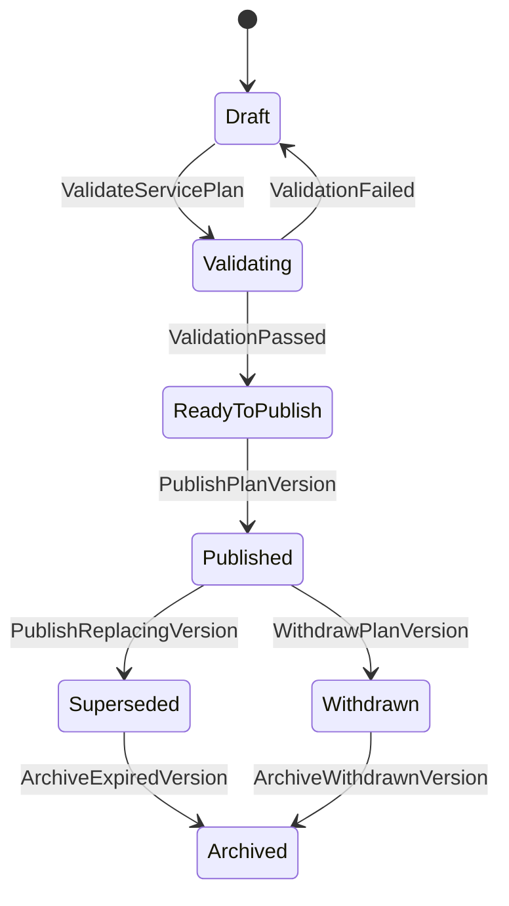
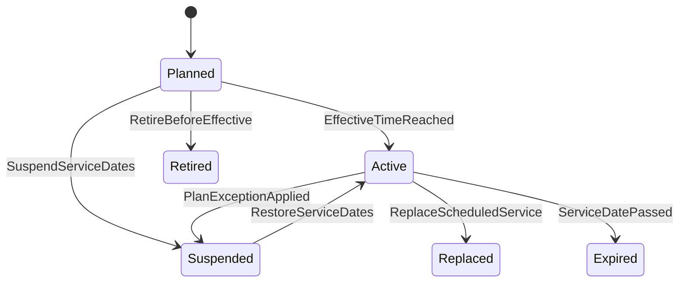

# Service Plan Domain Design

## Metadata

| Field | Value |
|---|---|
| Domain | Service Plan |
| Status | accepted-ddd-baseline |
| Owner Agent | agentm-service-plan |
| Last Updated | 2026-06-28 |
| High-Level Inputs | `docs/01-ddd-high-level/domain-glossary.md`, `docs/01-ddd-high-level/context-map.md`, `docs/01-ddd-high-level/general-travel-ddd.md` |

## 1. 领域目标

Service Plan 负责把供应侧承诺的计划供给表达成平台可消费的运行计划。它回答：哪条 Route 或 ServicePattern 在哪些日期运行、以什么 Timetable 停靠哪些 Transport Node、形成哪些 ServiceSegment，以及这些计划在什么时候对 Trip Planning 和 Capacity 生效。

它是独立边界，因为计划供给的生命周期和订单、库存、价格、履约不同：计划可能提前数月发布，按季节、节假日、调图、临时管控变更；同一计划可被搜索、库存初始化、异常影响范围和运营报表重复消费。Service Plan 只表达“计划存在且如何运行”，不表达“是否还有库存、卖多少钱、某个旅客是否已购买”。

## 2. 边界

### In Scope

- 管理固定班次类供给：火车车次、航班、船班、大巴班线、接驳班车等 ServicePlan。
- 管理 ServicePattern：线路方向、停靠序列、运行规则、适用承运商和服务模式。
- 管理 ScheduledService：某个日期或时间窗内实例化的计划服务。
- 管理 ServiceSegment：由停靠序列派生的可规划区间或航段、船段、乘车段。
- 管理 Calendar：运行日、停运日、加班日、季节性、节假日、特殊工作日和例外日期。
- 管理 Timetable：计划到发时刻、停靠时长、跨日标识、时区、服务时长。
- 管理 Frequency 和 Headway：高频公交、接驳或轮渡的班距计划，而非每趟明确编号。
- 管理计划版本、草稿、校验、发布、撤回和生效窗口。
- 表达计划性停运、计划性时刻调整、站点跳停、临时加开和临时替代服务。
- 向 Trip Planning 发布可搜索的计划段，向 Capacity 发布可初始化库存的计划服务。

### Out of Scope

- 不拥有 Place & Network 的 Place、Transport Node、站点层级、地理拓扑和换乘步行网络，只引用其稳定标识和快照版本。
- 不拥有 Capacity & Availability 的座席、舱位、票额、司机供给、余票、Hold、Quota 或可售判断。
- 不拥有实时 Disruption Recovery 的延误、取消后的恢复方案、保护性改乘和用户补偿。
- 不拥有 Fare & Pricing 的票价、税费、手续费、票规和折扣。
- 不拥有 Offer、Journey Order、Segment Booking、Entitlement、Payment 或 Post Sales 状态。
- 不直接接入供应商原始 API；供应商计划数据通过 Provider Integration ACL 或运营后台导入。
- 不决定某个 Segment 是否对特定用户可购买；下单前仍由 Offer、Capacity 和规则上下文确认。

## 3. 统一语言补充

| Term | Definition | Notes |
|---|---|---|
| ServicePlan | 一组可发布的计划供给，包含 ServicePattern、Calendar、Timetable 和版本信息。 | 本领域聚合根之一。 |
| ServicePattern | 某类服务的稳定模式，如车次方向、航线、班线、船线或接驳服务模式。 | 不绑定具体运行日期。 |
| ScheduledService | ServicePattern 在某个运行日期或时间窗实例化后的计划服务。 | 可用于 Capacity 初始化和 Trip Planning 展示。 |
| ServiceStop | Timetable 中的一个停靠点引用，包含到达、出发、停靠、上下客规则。 | Transport Node 归 Place & Network。 |
| StopSequence | ServicePattern 内有序停靠序列。 | 顺序是本领域不变量，地理连通性不是。 |
| ServiceSegment | 从 StopSequence 中两个有序停靠点派生出的可规划服务段。 | 不代表库存，也不代表 booking。 |
| Calendar | 服务运行日期规则和例外日期集合。 | 支持季节性、节假日、临时加开和计划停运。 |
| Timetable | 计划到达、出发、跨日和时区规则。 | 只表达计划时间，不表达实际运行时间。 |
| Frequency | 在一个时间窗内按频次运行的计划。 | 适合轮渡、接驳、大巴流水班。 |
| Headway | 高频服务相邻班次的计划间隔。 | 可与 Timetable 互斥或组合使用。 |
| PlanVersion | ServicePlan 的可发布版本。 | 发布后只追加修订，不原地覆盖历史。 |
| PlanException | 对 Calendar 或 Timetable 的计划性例外。 | 与实时 Disruption 区分。 |

## 4. 上下游契约

### Upstream

| Upstream Context | Consumed Contract | Reason |
|---|---|---|
| Supplier Catalog | Supplier、Carrier、ContractCapability、ServiceMode | 确认计划归属、承运主体和允许的服务类型。 |
| Place & Network | PlaceId、TransportNodeId、NodeSnapshotVersion、Timezone | ServiceStop 只引用节点，不复制地理拓扑。 |
| Admin & Audit | OperatorCommand、ApprovalResult、AuditActor | 高风险计划发布、停运和批量导入需要权限与审计。 |
| Provider Integration | ImportedScheduleFeed、ProviderScheduleChange、ProviderDataQualityReport | 外部铁路、航司、大巴、船司计划通过 ACL 转成平台语言。 |

### Downstream

| Downstream Context | Published Contract | Reason |
|---|---|---|
| Trip Planning | PublishedServicePlan、ServiceSegment、SearchableSchedule、PlanVersionPublished | 路线搜索和 Itinerary 生成依赖计划供给。 |
| Capacity & Availability | ScheduledServiceActivated、ServiceSegmentDefined、PlanCapacitySeed | 库存上下文按计划实例初始化容量或外部可用性查询键。 |
| Transfer Management | StopTimeMatrix、PlannedArrivalDeparture、SegmentConnectionHint | 中转可达性需要计划到发和节点顺序。 |
| Disruption Recovery | PlannedServiceScope、PlanChangePublished、ScheduledServiceSuspended | 异常影响范围要知道原计划覆盖哪些服务和乘客段。 |
| Reporting | ServicePlanSnapshot、PlanChangeHistory | 运营分析计划发布、覆盖率、停运和调整影响。 |
| Notification | PlanChangeNoticeRequested | 计划性调整可能触发面向用户或运营的通知。 |

## 5. 聚合设计

| Aggregate Root | Invariants | Commands | Events |
|---|---|---|---|
| ServicePlan | 同一 PlanVersion 内 ServicePattern、Calendar、Timetable 必须一致；发布版本不可原地修改；生效窗口不能与同一业务键的已发布版本冲突。 | CreateServicePlan、ValidateServicePlan、PublishPlanVersion、WithdrawPlanVersion | ServicePlanCreated、ServicePlanValidated、PlanVersionPublished、PlanVersionWithdrawn |
| ServicePattern | StopSequence 至少包含两个 ServiceStop；停靠顺序唯一且递增；ServiceMode 与承运商能力兼容；按需模式不能生成固定库存语义。 | DefineServicePattern、UpdateStopSequence、ClassifyServiceMode | ServicePatternDefined、StopSequenceChanged、ServiceModeClassified |
| Calendar | 运行日规则和例外日必须可归一成有限日期集合或可计算规则；加开和停运例外不能同日同服务冲突。 | DefineCalendar、AddCalendarException、SuspendServiceDates、RestoreServiceDates | CalendarDefined、CalendarExceptionAdded、ScheduledServiceSuspended、ScheduledServiceRestored |
| Timetable | 每个 ServiceStop 的时间相对顺序有效；跨日和时区转换明确；Frequency 与逐趟 Timetable 的互斥关系明确。 | DefineTimetable、AdjustStopTime、DefineFrequencyWindow | TimetableDefined、StopTimeAdjusted、FrequencyWindowDefined |
| ScheduledService | 只能由已验证计划版本生成；业务键在运行日期内唯一；状态变更必须保留来源版本。 | MaterializeScheduledService、ReplaceScheduledService、RetireScheduledService | ScheduledServiceMaterialized、ScheduledServiceReplaced、ScheduledServiceRetired |

## 6. 状态机

### ServicePlan 状态

状态含义：

- `Draft`：运营或导入流程正在编辑，不能被下游消费。
- `Validating`：校验停靠、日历、时刻、业务键、版本冲突和节点引用。
- `ReadyToPublish`：校验通过，等待权限或发布时间。
- `Published`：在生效窗口内作为下游权威计划。
- `Superseded`：被新版本替代，但仍可用于历史订单解释。
- `Withdrawn`：发布后因错误或管控撤回，必须发布撤回事件。
- `Archived`：只保留审计和历史查询，不参与新搜索。

### ScheduledService 状态

`Suspended` 是计划性停运，不等同实时取消；实时取消由 Disruption Recovery 接管并引用 ScheduledService。

## 7. 命令和领域事件

| Command | Aggregate | Event | Idempotency Key |
|---|---|---|---|
| CreateServicePlan | ServicePlan | ServicePlanCreated | `sourceSystem + externalPlanId + draftBatchId` |
| DefineServicePattern | ServicePattern | ServicePatternDefined | `planId + patternKey + version` |
| UpdateStopSequence | ServicePattern | StopSequenceChanged | `patternId + changeRequestId` |
| DefineCalendar | Calendar | CalendarDefined | `planId + calendarKey + version` |
| AddCalendarException | Calendar | CalendarExceptionAdded | `calendarId + exceptionDate + reasonCode + requestId` |
| DefineTimetable | Timetable | TimetableDefined | `planId + timetableKey + version` |
| DefineFrequencyWindow | Timetable | FrequencyWindowDefined | `timetableId + timeWindow + headway + requestId` |
| ValidateServicePlan | ServicePlan | ServicePlanValidated | `planId + planVersion + validationRunId` |
| PublishPlanVersion | ServicePlan | PlanVersionPublished | `planId + planVersion + publishRequestId` |
| MaterializeScheduledService | ScheduledService | ScheduledServiceMaterialized | `planVersion + serviceDate + serviceKey` |
| SuspendServiceDates | Calendar | ScheduledServiceSuspended | `planId + serviceDateRange + reasonCode + requestId` |
| ReplaceScheduledService | ScheduledService | ScheduledServiceReplaced | `oldScheduledServiceId + newScheduledServiceId + requestId` |
| WithdrawPlanVersion | ServicePlan | PlanVersionWithdrawn | `planId + planVersion + withdrawalRequestId` |

## 8. 策略和 Saga 参与点

- 当 `ProviderScheduleChange` 到达时，Service Plan 通过 ACL 生成草稿版本，校验通过后发布 `PlanVersionPublished`；若影响已售服务，只发布计划变化事实，由 Disruption Recovery、Post Sales 和 Notification 决定用户处理。
- 当 `TransportNodeDeprecated` 或节点时区变更由 Place & Network 发布时，Service Plan 标记受影响 ServiceStop，生成修订版本或阻止继续发布。
- 当 `PlanVersionPublished` 发布后，Capacity & Availability 可订阅并创建容量初始化任务；Trip Planning 可重建 Search Index。
- 当 `ScheduledServiceSuspended` 为未来日期计划停运时，Capacity & Availability 停止新增可售，Trip Planning 隐藏或降权该服务，Notification 仅对已关联订单的用户发送计划变更提示。
- 当 Admin & Audit 记录高风险操作审批通过后，Service Plan 才允许批量撤回、跨日历大规模停运、替换承运商或发布覆盖既有版本的修订。
- Service Plan 不编排付款、退款、出票或改签 Saga；它只提供触发这些 Saga 所需的计划事实和影响范围。

## 9. 读模型

| Read Model | Source Events | Consumers |
|---|---|---|
| PublishedScheduleIndex | PlanVersionPublished、ScheduledServiceMaterialized、TimetableDefined | Trip Planning、搜索缓存、运营查询 |
| ServiceSegmentCatalog | ServicePatternDefined、StopSequenceChanged、ScheduledServiceMaterialized | Trip Planning、Capacity & Availability、Offer Management |
| CalendarAvailabilityView | CalendarDefined、CalendarExceptionAdded、ScheduledServiceSuspended、ScheduledServiceRestored | Trip Planning、运营后台、Reporting |
| StopTimeMatrix | TimetableDefined、StopTimeAdjusted、FrequencyWindowDefined | Transfer Management、Trip Planning |
| PlanChangeTimeline | PlanVersionPublished、ScheduledServiceReplaced、PlanVersionWithdrawn | Customer Service、Admin & Audit、Reporting |
| CapacitySeedView | ScheduledServiceMaterialized、ServiceSegmentDefined、ScheduledServiceRetired | Capacity & Availability |
| DisruptionScopeSeed | ScheduledServiceSuspended、PlanVersionWithdrawn、ScheduledServiceReplaced | Disruption Recovery、Notification |

## 10. 外部系统和防腐层

Service Plan 需要面对不同供应商和交通方式的数据语言，但核心模型只接受平台 Published Language。

| External Source | ACL Mapping | Protection Rule |
|---|---|---|
| 铁路调图、车次、经停、开行日 | Train number → ServicePattern；经停表 → StopSequence；开行日 → Calendar | 不把铁路内部票额、席别余票放入 Service Plan。 |
| 航司/GDS/NDC 航班计划 | Flight leg → ScheduledService；机场航站楼 → ServiceStop reference | PNR、舱位、票价族留在 Provider Integration、Capacity 或 Fare。 |
| 大巴公司班线表 | Coach line → ServicePattern；上车点 → TransportNodeId | 非标准上车点必须先进入 Place & Network，不能在本域自造地点。 |
| 船司船期 | Sailing → ScheduledService；港口/码头 → ServiceStop | 舱房、车辆甲板容量不进入 Timetable。 |
| 接驳或高频班线 | Frequency/Headway → FrequencyWindow | 只表达计划班距，不表达实时车辆位置。 |
| 运营后台批量导入 | CSV/Excel/API → Draft ServicePlan | 导入错误形成校验报告，不部分发布不一致版本。 |

防腐层负责字段清洗、供应商编码映射、时区归一、重复记录合并、幂等键生成、错误报告和来源追踪。核心聚合不保存供应商原始状态码作为业务状态。

## 11. 当前服务迁移影响

| Current Service | Migration Impact |
|---|---|
| `travel-service` 或历史车次查询模块 | 将车次、站序、运行日和时刻拆出为 ServicePlan、ServicePattern、Calendar、Timetable；查询接口改读 PublishedScheduleIndex。 |
| `preserve-service` 或订票模块 | 停止直接解析车次表生成订单段，改引用 ServiceSegment 和 ScheduledServiceId。 |
| `station-service` 或地点基础表 | 站点、机场、港口、上车点迁入 Place & Network；Service Plan 只保存 TransportNodeId 与节点快照版本。 |
| `ticket-service` 或余票模块 | 余票初始化从 CapacitySeedView 消费计划事件，区间库存仍归 Capacity & Availability。 |
| `admin-service` 运营配置 | 批量导入、审批、发布、撤回改为命令式入口，并把审计写入 Admin & Audit。 |
| `search-service` | 搜索索引从历史静态表切换到 PublishedScheduleIndex 和 CalendarAvailabilityView。 |
| `notification-service` | 不再扫描计划表判断通知，改消费 PlanChangeNoticeRequested 或计划事件。 |
| 离线报表任务 | 使用 PlanChangeTimeline 和 ServicePlanSnapshot 重建计划变更维度。 |

## 12. 验收标准

- Service Plan 的聚合所有权明确：计划、模式、日历、时刻、计划实例和计划段归本域；地点、库存、价格、订单、票证和实时恢复不归本域。
- 固定班次与按需/预约服务差异明确：固定班次使用 ScheduledService；高频服务使用 Frequency/Headway；即时网约车进入 Dispatch。
- Calendar 支持季节性、节假日、例外日、临时加开、计划停运和恢复，且与实时 Disruption 区分。
- Timetable 支持停靠序列、跨日、时区、停靠时长和高频班距，且不表达实际到发。
- 发布版本不可原地覆盖，历史 PlanVersion 可解释既有订单和客服查询。
- Trip Planning 能通过 PublishedScheduleIndex、ServiceSegmentCatalog 和 StopTimeMatrix 生成候选 Itinerary。
- Capacity & Availability 能通过 ScheduledServiceMaterialized 和 CapacitySeedView 初始化库存或外部可用性查询键。
- 命令、事件和幂等键足以支撑导入、校验、发布、停运、替换、撤回和重放。
- 外部供应商数据必须经过 ACL 映射，供应商原始语言不污染核心模型。
- 文档没有遗留占位内容，且章节顺序与 domain design template 保持一致。
