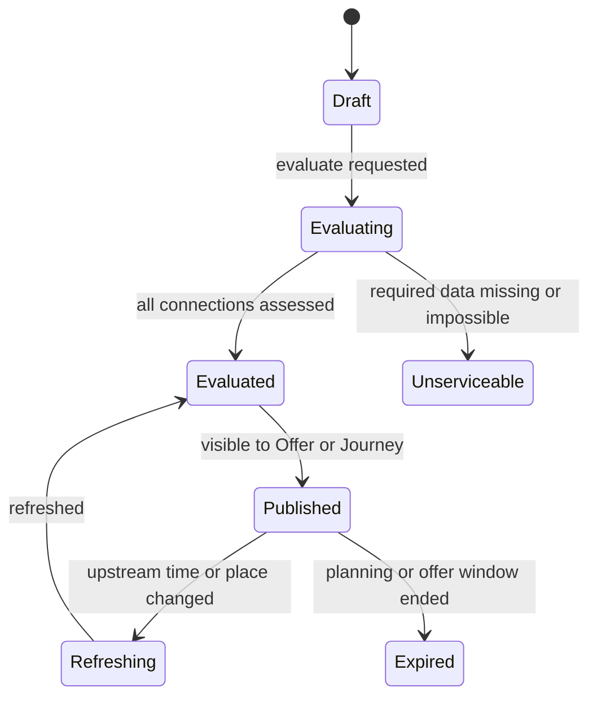
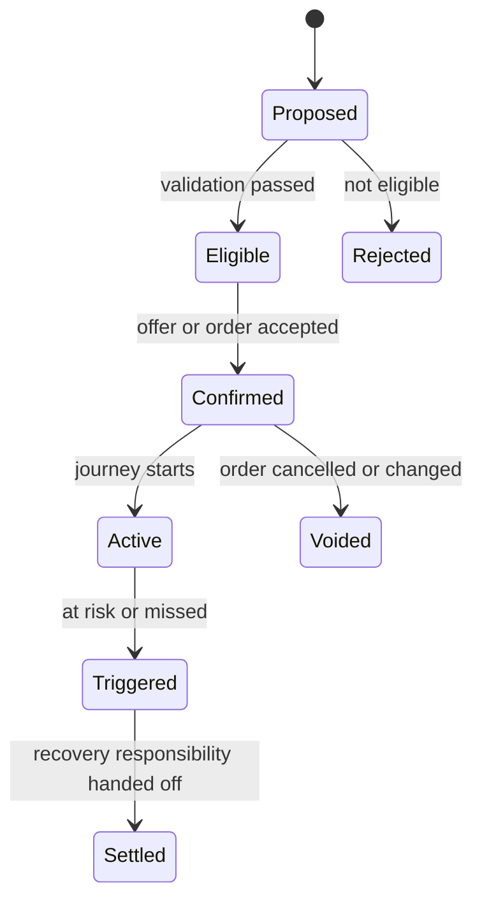

# Transfer Management Domain Design

## Metadata

| Field | Value |
|---|---|
| Domain | Transfer Management |
| Status | accepted-ddd-baseline |
| Owner Agent | agentm-transfer-management |
| Last Updated | 2026-06-28 |
| High-Level Inputs | `docs/01-ddd-high-level/domain-glossary.md`, `docs/01-ddd-high-level/context-map.md`, `docs/01-ddd-high-level/general-travel-ddd.md` |

## 1. 领域目标

Transfer Management 负责 General Travel 中联乘和中转连接语义。它把两个相邻 `Segment` 之间的 `Transfer` 从“时间差”提升为可评估、可展示、可承诺、可追踪的 `Connection`。

本 domain 的核心问题是：用户是否来得及从上一段到达点到下一段出发点，错过接续时谁负责，以及平台如何把运行中风险转换为恢复输入。它拥有 `ConnectionContract`、`MinimumConnectionTime`、`ProtectedConnection`、`SelfTransfer`、换乘风险、`MissedConnection` 判断和换乘恢复输入，但不执行订单、支付、出票或异常恢复。

Transfer Management 是独立边界，因为联乘不变量不同于路线搜索、地点主数据和订单状态。`Trip Planning` 生成候选方案但不拥有连接承诺；`Place & Network` 提供换乘拓扑和步行/接驳时间；`Journey Order` 保存购买承诺；`Disruption Recovery` 负责恢复执行。本域在这些上下文之间提供稳定的连接语言。

## 2. 边界

### In Scope

- 建模 `Connection`：相邻 Segment、换乘地点、连接时间、换乘路径、服务约束和旅客约束。
- 维护 `ConnectionContract`：平台保障、供应商保障、平台协助、非保护 `SelfTransfer` 的责任边界。
- 评估 `MinimumConnectionTime`：同站、异站、站内换乘、跨 Terminal、机场/港口/汽车站、网约车接驳、行李、安检、无障碍和出入境耗时。
- 生成和刷新 `TransferPlan`：售前可行性、报价前保障资格、出行中实时风险和恢复输入。
- 标记 `ProtectedConnection`、`SelfTransfer`、`PlatformAssistedConnection`、`SupplierProtectedConnection` 的展示和售后语义。
- 消费履约事件判断 `Transfer` 是否 `Feasible`、`Tight`、`AtRisk`、`Missed` 或 `Recovered`。
- 发布 `TransferRiskEvaluated`、`TransferAtRisk`、`ConnectionMissed`、`ConnectionRecovered` 等事件。
- 为 `Offer Management`、`Journey Order`、客服和异常恢复提供换乘风险读模型与责任解释。

### Out of Scope

- 不生成端到端候选 Itinerary；候选方案由 `Trip Planning` 负责。
- 不拥有 Place Graph、站内路径、GeoFence、外部地图耗时和供应商地点码；这些由 `Place & Network` 防腐后提供。
- 不创建或冻结 Offer，不计算票价、保障费、保险费或退改手续费。
- 不创建 Journey Order，不保存用户购买主状态，不决定订单是否确认。
- 不锁库存、不预订、不出票、不作废凭证，不处理供应商确认状态机。
- 不执行改签、退款、住宿、补偿或重新安排行程；这些由 `Disruption Recovery`、`Post Sales`、`Booking Orchestration` 和 `Payment` 执行。
- 不直接消费供应商原始延误码、机场 MCT 码或网约车派单状态；必须通过上游标准事件和 ACL。

## 3. 统一语言补充

| Term | Definition | Notes |
|---|---|---|
| Transfer | 两个相邻 Segment 之间的换乘过程 | 包含移动、等待、取行李、安检、重新检票、接驳等动作 |
| Connection | 被本域评估和追踪的 Transfer 实例 | 绑定前后 Segment、旅客、地点版本和合同版本 |
| ConnectionContract | 中转失败后的责任和权益契约 | 决定是否保护、谁承担成本、恢复可用范围 |
| ProtectedConnection | 平台或供应商承诺保护的 Connection | 错过接续可触发免费或优先恢复输入 |
| SupplierProtectedConnection | 供应商或联盟内部保护的连接 | 责任规则来自供应商，但平台保留解释和协助视图 |
| PlatformAssistedConnection | 平台协助但不完全兜底的连接 | 可提供重订、客服、优惠或部分补偿 |
| SelfTransfer | 用户自行承担风险的非保护连接 | 必须在报价和下单前明确披露 |
| MinimumConnectionTime | 满足某类换乘所需的最短时间 | 来自地点拓扑、交通方式、旅客和服务约束 |
| ConnectionWindow | 上一段实际或计划到达与下一段截止时间之间的可用时间 | 截止时间可能是发车、停止检票、关舱门或司机等待超时 |
| TransferRisk | 换乘风险等级和原因集合 | Feasible、Tight、AtRisk、Missed、Recovered 等状态的依据 |
| MissedConnection | 因上一段异常、路径受阻或旅客无法按时到达导致接续失败 | 是本域事实，不等于恢复已经完成 |
| RecoveryInput | 传给 Disruption Recovery 的结构化恢复输入 | 包含合同、剩余行程、位置、时间压力和责任方 |
| BaggageTransferRequirement | 行李衔接要求 | 直挂、自取、重新托运、超大件、车辆上船 |
| SecurityRecheckRequirement | 安检、出入境或实名核验要求 | 影响机场、港口、跨境和站内换乘时间 |
| AccessibilityTransferNeed | 无障碍换乘需求 | 轮椅、电梯、少步行、协助服务、坡道可用性 |

## 4. 上下游契约

### Upstream

| Upstream Context | Consumed Contract | Reason |
|---|---|---|
| Trip Planning | `TransferPlanRequested`, `TransferCandidate`, `ConnectionIntent`, `ItineraryReference` | 对候选 Itinerary 做连接可行性和保障资格评估 |
| Place & Network | `TransferNodeGraph`, `MinimumConnectionTimeInput`, `AccessibilityProfile`, `PlaceGraphVersion` | 获取同站/异站/站内/站外/接驳路径和约束基线 |
| Service Plan | `Schedule`, `StopPattern`, `BoardingCutoff`, `CheckInWindow` | 计算计划 ConnectionWindow 和下一段截止时间 |
| Fulfillment | `SegmentArrived`, `SegmentDelayed`, `SegmentCancelled`, `BoardingGateChanged`, `BaggageClaimDelayed` | 运行中刷新连接风险和 MissedConnection 判断 |
| Journey Order | `JourneyConnectionCommitted`, `OrderTravelerSnapshot`, `PurchasedConnectionContract` | 获取用户购买时被承诺的连接和旅客约束快照 |
| Entitlement & Ticketing | `EntitlementIssued`, `BoardingPassUpdated`, `TicketValidityChanged` | 判断下一段凭证是否仍可使用以及截止时间变化 |
| Traveler Profile | `AccessibilityProfile`, `DocumentCapability`, `TravelerAssistanceNeed` | 旅客个人约束影响 MinimumConnectionTime 和风险解释 |
| Ancillary Service | `BaggageServiceStatus`, `AssistanceServiceConfirmed` | 行李和无障碍服务状态影响换乘可行性 |

### Downstream

| Downstream Context | Published Contract | Reason |
|---|---|---|
| Offer Management | `ConnectionRiskQuoted`, `SelfTransferDisclosureInput`, `ProtectedConnectionEligibility` | 报价时展示风险、冻结披露和计算保障产品资格 |
| Journey Order | `ConnectionContractConfirmed`, `ConnectionSnapshot` | 订单保存购买承诺和后续售后解释依据 |
| Disruption Recovery | `ConnectionAtRiskRecoveryInput`, `MissedConnectionRecoveryInput` | 异常恢复执行需要责任、位置、剩余行程和时间压力 |
| Customer Service | `ConnectionTimeline`, `ConnectionResponsibilityView` | 客服解释错过接续责任、风险提示和可选恢复路径 |
| Notification | `TransferAtRiskNotificationRequested`, `ConnectionInstructionUpdated` | 通知用户加快换乘、改走路径、取行李或联系协助 |
| Reporting | `ConnectionRiskEvaluated`, `ConnectionMissed`, `ConnectionRecovered` | 分析联乘成功率、MCT 准确性、保障成本和供应商质量 |
| Trip Planning | `TransferFeasibilityResult`, `ConnectionContractOption` | 售前方案刷新时复用连接评估结果 |

## 5. 聚合设计

| Aggregate Root | Invariants | Commands | Events |
|---|---|---|---|
| TransferPlan | 必须引用一个 Itinerary 或 Journey；相邻 Segment 顺序不可颠倒；每个 Transfer 必须有地点版本和评估版本；售前结果不等于订单承诺 | `CreateTransferPlan`, `EvaluateTransferPlan`, `RefreshTransferPlan`, `ExpireTransferPlan` | `TransferPlanCreated`, `TransferPlanEvaluated`, `TransferPlanRefreshed`, `TransferPlanExpired` |
| Connection | 必须绑定 previousSegmentId、nextSegmentId、travelerSet 和 ConnectionContract；状态推进必须基于计划时间、实际履约事件或人工受控输入；Missed 后不能回到 Feasible | `RegisterConnection`, `RefreshConnectionRisk`, `MarkConnectionAtRisk`, `DeclareMissedConnection`, `MarkConnectionRecovered` | `ConnectionRegistered`, `TransferRiskEvaluated`, `TransferAtRisk`, `ConnectionMissed`, `ConnectionRecovered` |
| ConnectionContract | contractType、责任方、保障范围、披露文本和版本不可缺失；订单确认后合同快照不可原地修改；SelfTransfer 必须有用户可见披露 | `ProposeConnectionContract`, `ConfirmConnectionContract`, `WithdrawConnectionContract`, `ReviseDisclosure` | `ConnectionContractProposed`, `ConnectionContractConfirmed`, `ConnectionContractWithdrawn`, `ConnectionDisclosureRevised` |
| MinimumConnectionTimeRule | 规则必须绑定地点类型、路径类型、交通方式、旅客/行李/安检条件和有效期；Published 版本不可变；低置信度输入必须标注 | `CreateMctRule`, `ValidateMctRule`, `PublishMctRule`, `RetireMctRule` | `MctRuleCreated`, `MctRuleValidated`, `MctRulePublished`, `MctRuleRetired` |
| TransferRiskPolicy | 风险阈值、颜色、排序权重和通知触发条件必须可解释；策略版本必须进入评估结果 | `ActivateRiskPolicy`, `SimulateRiskPolicy`, `RetireRiskPolicy` | `RiskPolicyActivated`, `RiskPolicySimulated`, `RiskPolicyRetired` |

## 6. 状态机

### TransferPlan 生命周期

### Connection 运行状态

| State | Meaning | Allowed Next |
|---|---|---|
| Planned | 基于计划时刻和静态 MCT 生成 | Feasible, Tight, Invalidated |
| Feasible | 可用时间大于 MCT 和缓冲阈值 | Tight, AtRisk, Completed, Invalidated |
| Tight | 可达但缓冲不足，需要提示用户 | Feasible, AtRisk, Missed, Completed |
| AtRisk | 延误、路径变化、行李或安检导致高风险 | Tight, Missed, Recovered |
| Missed | 已无法满足下一段截止时间或下一段已关闭 | Recovered, SelfHandled |
| Recovered | 已由恢复流程提供可接受替代或连接重新成立 | Completed |
| SelfHandled | SelfTransfer 场景用户自行补救或放弃保护恢复 | Completed |
| Completed | 下一段已登乘、上车、登船或连接风险窗口结束 | 终态 |
| Invalidated | 订单取消、行程重订或合同撤回导致连接失效 | 终态 |

### ConnectionContract 状态

## 7. 命令和领域事件

| Command | Aggregate | Event | Idempotency Key |
|---|---|---|---|
| CreateTransferPlan | TransferPlan | TransferPlanCreated | `itineraryId:planningVersion:requestId` |
| EvaluateTransferPlan | TransferPlan | TransferPlanEvaluated | `transferPlanId:mctVersion:riskPolicyVersion` |
| RegisterConnection | Connection | ConnectionRegistered | `journeyId:previousSegmentId:nextSegmentId:travelerHash` |
| ProposeConnectionContract | ConnectionContract | ConnectionContractProposed | `connectionId:contractType:contractVersion` |
| ConfirmConnectionContract | ConnectionContract | ConnectionContractConfirmed | `connectionContractId:offerId:acceptedVersion` |
| RefreshConnectionRisk | Connection | TransferRiskEvaluated | `connectionId:fulfillmentVersion:riskPolicyVersion` |
| MarkConnectionAtRisk | Connection | TransferAtRisk | `connectionId:riskCause:firstDetectedAt` |
| DeclareMissedConnection | Connection | ConnectionMissed | `connectionId:missedCause:deadlineVersion` |
| MarkConnectionRecovered | Connection | ConnectionRecovered | `connectionId:recoveryCaseId:acceptedOptionId` |
| CreateMctRule | MinimumConnectionTimeRule | MctRuleCreated | `fromNodeType:toNodeType:conditionHash:validFrom` |
| PublishMctRule | MinimumConnectionTimeRule | MctRulePublished | `mctRuleId:version` |
| ActivateRiskPolicy | TransferRiskPolicy | RiskPolicyActivated | `riskPolicyId:version` |
| ReviseDisclosure | ConnectionContract | ConnectionDisclosureRevised | `contractType:locale:disclosureVersion` |

## 8. 策略和 Saga 参与点

- 当 `TransferPlanRequested` 到达时，本域按 Itinerary 的相邻 Segment 创建 TransferPlan，并结合 Place Graph、Service Plan、旅客约束和 ConnectionIntent 评估连接。
- 当评估结果为 `SelfTransfer` 时，策略要求生成可追溯披露输入；Offer 或订单只有引用披露版本后才能进入购买承诺。
- 当 `SegmentDelayed`、`SegmentArrived`、`BoardingGateChanged`、`BaggageClaimDelayed` 或 `SegmentCancelled` 到达时，本域刷新 ConnectionWindow，并可能发布 `TransferAtRisk` 或 `ConnectionMissed`。
- 当 `ConnectionMissed` 发生且 ConnectionContract 为 ProtectedConnection 或 SupplierProtectedConnection，本域构造 `MissedConnectionRecoveryInput`，交给 Disruption Recovery 执行恢复。
- 当 PlatformAssistedConnection 进入 AtRisk，本域可触发通知、客服优先级和可购买替代方案输入，但不承诺免费恢复。
- 当 SelfTransfer 进入 Missed，本域只发布事实、风险提示和自助补救输入；Post Sales 仍按单段规则处理。
- 当 PlaceGraphVersion、MCT 规则或风险策略更新时，本域只刷新未承诺的 TransferPlan；已确认订单使用购买时的 ConnectionSnapshot 和合同快照。
- 当恢复流程接受替代方案后，本域消费 `ReaccommodationAccepted` 或等价事件，把原 Connection 标记为 Recovered 或 Invalidated，并注册新连接。

## 9. 读模型

| Read Model | Source Events | Consumers |
|---|---|---|
| TransferPlanSummary | `TransferPlanCreated`, `TransferPlanEvaluated`, `TransferPlanRefreshed` | Trip Planning、Offer Management、搜索详情页 |
| ConnectionRiskView | `ConnectionRegistered`, `TransferRiskEvaluated`, `TransferAtRisk` | 前端行程页、Notification、客服 |
| ConnectionContractView | `ConnectionContractProposed`, `ConnectionContractConfirmed`, `ConnectionDisclosureRevised` | Offer Management、Journey Order、Customer Service |
| MinimumConnectionTimeMatrix | `MctRulePublished`, Place & Network MCT inputs | Trip Planning、Transfer Management 内部评估 |
| MissedConnectionTimeline | `TransferAtRisk`, `ConnectionMissed`, `ConnectionRecovered` | Disruption Recovery、客服、争议处理 |
| SelfTransferDisclosureLedger | `ConnectionContractConfirmed`, `ConnectionDisclosureRevised` | Journey Order、法务合规、客服 |
| ProtectedConnectionExposure | `ConnectionContractConfirmed`, `ConnectionMissed`, `ConnectionRecovered` | Reporting、Finance Settlement、运营风控 |
| AccessibilityTransferView | `TransferRiskEvaluated`, Traveler/Place accessibility inputs | 无障碍服务、客服、前端提示 |
| BaggageConnectionView | `TransferRiskEvaluated`, `BaggageServiceStatus` | Offer Management、Ancillary Service、Disruption Recovery |
| RecoveryInputQueue | `TransferAtRisk`, `ConnectionMissed` | Disruption Recovery、Customer Service |

## 10. 外部系统和防腐层

Transfer Management 不直接集成铁路、航司、船司、大巴公司、网约车平台或地图商。所有外部语言必须被上游上下文转译为平台契约后再进入本域。

防腐层要求：

1. 航空 Minimum Connection Time、航站楼关闭时间、登机口变更和行李转盘信息由 Provider Integration、Service Plan、Fulfillment 或 Place & Network 映射为标准 `MinimumConnectionTimeInput` 和履约事件。
2. 铁路换乘站、同站便捷换乘、停止检票时间和晚点信息映射为 `BoardingCutoff`、`SegmentDelayed`、`SegmentArrived`，不暴露原始车站公告码。
3. 港口安检、车辆登船、码头变更和天气封航映射为 Port/Terminal 约束、Service Plan 变更和 Disruption 事件。
4. 大巴上车点、临时停靠点和站外候车点必须先进入 Place & Network 的标准节点和 GeoFence，再参与 Connection 评估。
5. 网约车接驳只作为 Transfer 的移动方式或 Segment 的一部分出现；司机派单、ETA 波动和取消由 Dispatch/Fulfillment 转译为标准事件。
6. 地图耗时、步行路线和道路拥堵只能作为 Place & Network 或 Dispatch 的输入；本域保存其版本和置信度，不保存第三方原始字段。
7. 所有供应商保护规则必须映射为 `ConnectionContract`，不能让 PNR、联程票号、承运人协议码直接成为本域不变量。

## 11. 当前服务迁移影响

| Current Service | Migration Impact |
|---|---|
| 搜索结果中的换乘时间计算 | 从前端或查询服务迁移为 TransferPlan 评估；搜索只展示本域输出的风险和解释 |
| 中转方案筛选规则 | 拆为 MinimumConnectionTimeRule 和 TransferRiskPolicy，规则版本进入评估结果和审计 |
| 多段订单备注中的联程说明 | 迁移为 ConnectionContractSnapshot；订单保存合同类型、披露版本和责任方 |
| 晚点提醒逻辑 | 改为 Fulfillment 事件驱动的 ConnectionRiskView；Notification 只负责发送，不判断错过接续 |
| 客服人工判断误车/误机 | 迁移为 MissedConnectionTimeline 和责任解释视图，人工修正走受控命令并审计 |
| 站内换乘配置表 | 静态路径和 MCT 基线归 Place & Network；风险阈值和合同规则归 Transfer Management |
| 保障服务或误点险展示 | Offer Management 引用 ProtectedConnectionEligibility；保障定价归 Fare & Pricing 或 Ancillary Service |
| 异常恢复入口 | Disruption Recovery 消费 MissedConnectionRecoveryInput，不再从订单备注或供应商原始状态推断 |
| 历史联程订单 | 批量生成只读 ConnectionSnapshot；缺失合同的历史订单按当时展示文案和票规推断责任等级 |

## 12. 验收标准

- 本 domain 的聚合所有权明确：TransferPlan、Connection、ConnectionContract、MinimumConnectionTimeRule、TransferRiskPolicy 均由 Transfer Management 拥有。
- 文档明确 Trip Planning 生成候选方案但不拥有连接承诺，Place & Network 提供拓扑和耗时输入，Journey Order 保存购买承诺，Disruption Recovery 执行异常恢复。
- 设计覆盖跨 modal、同站/异站、站内换乘、机场、港口、汽车站、网约车接驳、行李、安检、无障碍和旅客约束。
- ProtectedConnection、SupplierProtectedConnection、PlatformAssistedConnection、SelfTransfer、MinimumConnectionTime、MissedConnection 等术语语义清晰且可落地到命令、事件和读模型。
- 状态机只描述本域 TransferPlan、Connection 和 ConnectionContract，不定义订单、支付、出票、库存或供应商状态机。
- 命令和事件具备幂等键，事件使用已发生的业务事实，并能支撑报价、订单、通知、客服、报表和恢复输入。
- 防腐层避免供应商原始 PNR、站码、港口码、地图字段、司机派单状态污染核心模型。
- 当前服务迁移影响覆盖换乘计算、规则配置、订单承诺、晚点提醒、客服判断、保障展示和异常恢复入口。
