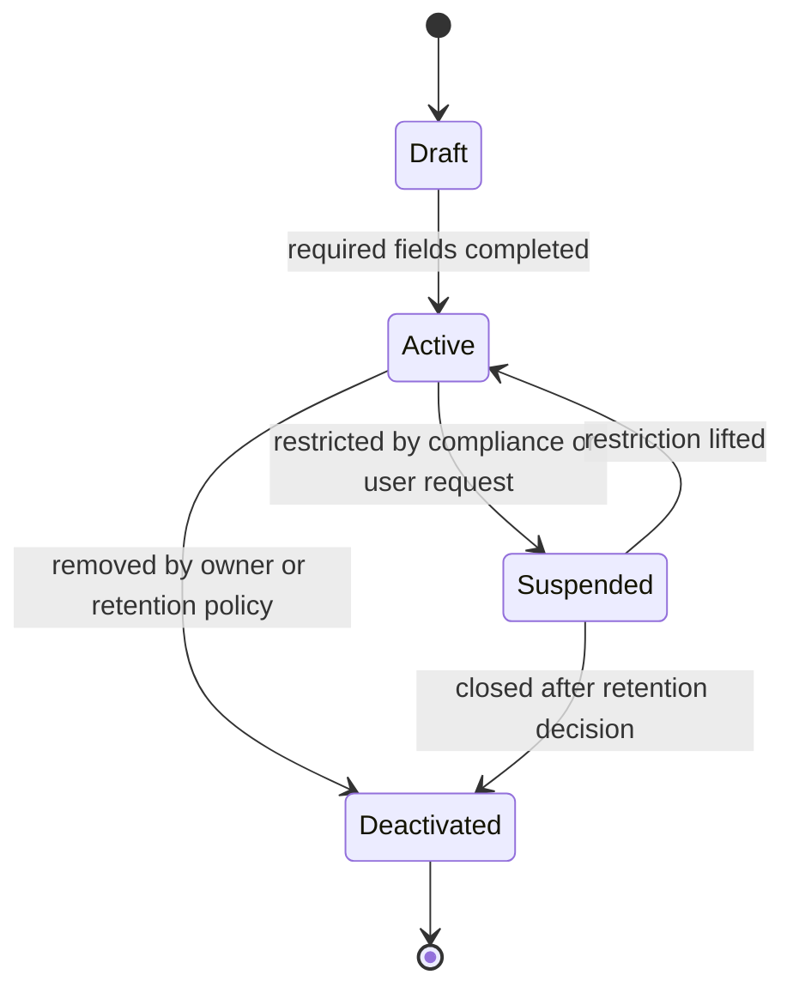
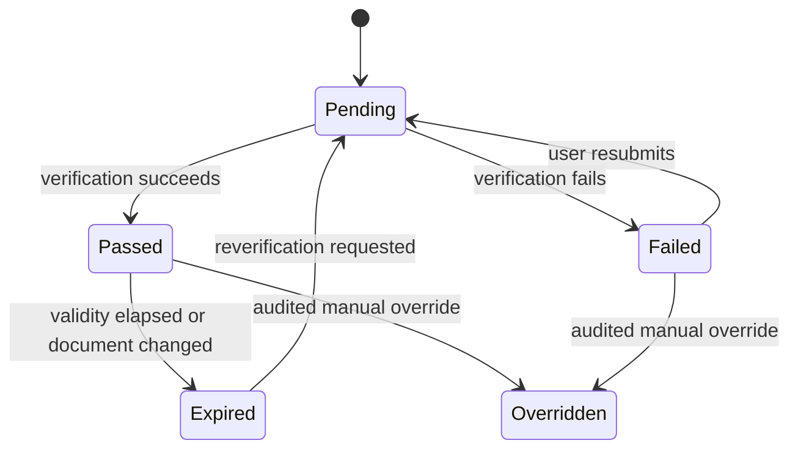
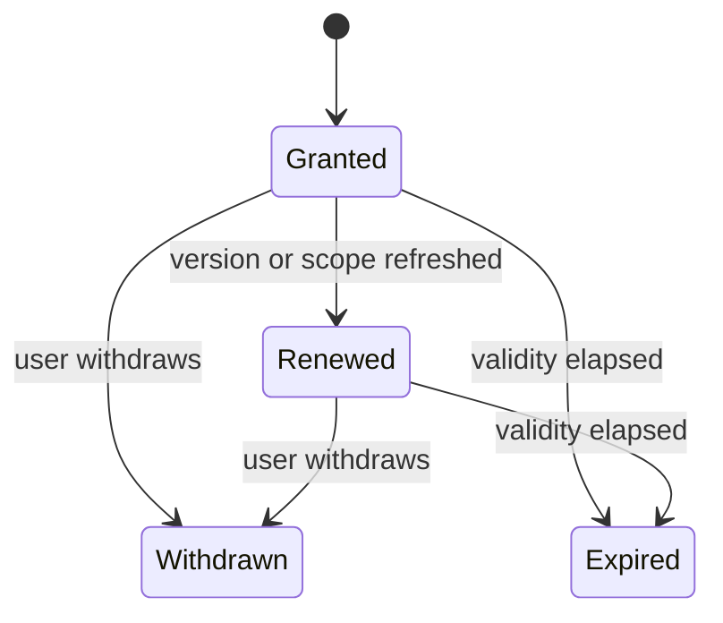

# Traveler Profile Domain Design

## Metadata

| Field | Value |
|---|---|
| Domain | Traveler Profile |
| Status | accepted-ddd-baseline |
| Owner Agent | agentm-traveler-profile |
| Last Updated | 2026-06-28 |
| High-Level Inputs | `docs/01-ddd-high-level/domain-glossary.md`, `docs/01-ddd-high-level/context-map.md`, `docs/01-ddd-high-level/general-travel-ddd.md` |

## 1. 领域目标

Traveler Profile 管理可被出行交易引用的旅客资料：身份、证件、实名核验、乘车/乘机/乘船资格、联系人、Preference、辅助需求、隐私 Consent 和稳定的 TravelerRef。它解决两个问题：

1. 在搜索、报价、下单、履约和售后之间提供一致的旅客引用，而不是在订单里复制一套会漂移的个人资料。
2. 在不暴露完整敏感信息的前提下，为 Offer Management、Journey Order、Risk & Compliance、Provider Integration 提供可校验的资格和证件输入。

Traveler Profile 是通用域，但必须认真建模，因为旅客资料错误会导致出票失败、实名拒绝、跨境出行受阻、优惠资格误用、无障碍服务遗漏和隐私合规风险。

## 2. 边界

### In Scope

- TravelerProfile 的创建、归属、合并、停用和审计。
- TravelerRef 的生成、版本化和跨上下文引用契约。
- IdentityDocument 的录入、脱敏展示、有效期、国家/地区、证件类型和主证件选择。
- Passenger 分类和 Eligibility 输入，包括儿童、老人、学生、军人、会员、企业协议、跨境和特殊服务资格。
- Verification 生命周期，包括实名核验、证件有效性核验、年龄推断、资格材料核验和过期重验。
- 联系人、紧急联系人、常用手机号/邮箱、Preference、无障碍辅助需求、携带婴儿或陪护说明。
- Consent 记录，包括资料使用授权、跨境传输授权、供应商提交授权、营销偏好和撤回。
- 多人出行场景中，一个 Account 下多个 TravelerProfile 的维护、选择和快照输出。
- 证件和资料访问审计、敏感字段加密、脱敏读模型和最小化输出。

### Out of Scope

- Account 的登录、注册、会话、账号安全、账号封禁和渠道账号绑定。
- JourneyOrder 的商业订单状态、支付状态、售后入口和订单生命周期。
- Booking Orchestration 的占座、供应商确认、多段补偿和出票推进。
- Risk & Compliance 的黑名单、反刷、重复行程、限购和最终风险决策。
- Provider Integration 的供应商证件字段映射、API 重试、供应商错误码翻译和原始报文保存。
- Entitlement & Ticketing 的票证、登机牌、乘车码和履约凭证生命周期。
- Ancillary Service 的具体服务库存、履约和收费；Traveler Profile 只表达旅客辅助需求输入。

## 3. 统一语言补充

| Term | Definition | Notes |
|---|---|---|
| TravelerProfile | 平台内可被出行交易引用的旅客资料聚合。 | 可属于一个 Account，也可由企业或代理托管。 |
| TravelerRef | 对外发布的稳定旅客引用，隐藏内部主键和敏感字段。 | JourneyOrder 只保存 TravelerRef 和购买快照。 |
| IdentityDocument | 身份证、护照、港澳台通行证、军官证、学生证等证件资料。 | 不直接暴露完整号码。 |
| Passenger | 某次 Journey 中的出行人角色。 | 来源于 TravelerProfile，但订单内只保存快照。 |
| Eligibility | 某类票价、服务或合规规则所需的资格输入。 | 例如儿童票、学生票、军人优待、会员价。 |
| Verification | 对身份、证件、年龄、资格材料的核验事实。 | 是 Traveler Profile 的状态，不等于风控允许。 |
| Consent | 旅客或监护人对资料使用、提交供应商、跨境传输的授权。 | 可撤回，撤回影响后续使用，不改写历史订单。 |
| Preference | 常用出行偏好，如座位、铺位、餐食、通知语言、无障碍偏好。 | 供报价和服务推荐使用，不保证供应商满足。 |
| AssistanceNeed | 无障碍、轮椅、陪护、听障/视障提示、携带医疗设备等辅助需求。 | 可能触发 Ancillary Service 或 Provider Integration 附加申报。 |
| ProfileSnapshot | 下单或报价时冻结的非敏感旅客资料摘要。 | 订单和供应商提交使用快照，避免后续修改反向影响。 |

## 4. 上下游契约

### Upstream

| Upstream Context | Consumed Contract | Reason |
|---|---|---|
| Account | AccountHolderLinked、AccountClosed、AccountSecurityFlagChanged | 绑定资料归属、处理账号关闭后的保留策略和安全限制。 |
| Admin & Audit | ManualProfileCorrectionApproved、RetentionPolicyChanged | 高风险人工修正和数据保留策略需要审计授权。 |
| Risk & Compliance | VerificationChallengeRequested、ProfileUseRestricted | 风险上下文可要求重验或限制资料使用，但不改写证件事实。 |
| Provider Integration | DocumentVerificationResultReceived | 外部实名或证件核验结果回写为 Verification 事实。 |

### Downstream

| Downstream Context | Published Contract | Reason |
|---|---|---|
| Offer Management | TravelerEligibilitySummary、PassengerComposition | 报价需要人数、年龄段、优惠资格和合规提示输入。 |
| Journey Order | TravelerRef、ProfileSnapshot、ConsentAssertion | 创建订单时冻结旅客引用、展示名、证件尾号和授权状态。 |
| Booking Orchestration | BookingTravelerManifest | 多段预订需要每段旅客清单、证件摘要和资格声明。 |
| Risk & Compliance | TravelerProfileChanged、VerificationStateChanged | 风控评估证件风险、重复行程和合规限制。 |
| Provider Integration | ProviderDocumentSubmissionRequest | 供应商适配层按供应商要求映射证件字段和提交资料。 |
| Notification | TravelerContactChanged、NotificationPreferenceChanged | 通知可使用联系人和语言偏好，但不得读取完整证件。 |
| Customer Service | TravelerProfileMaskedView | 客服查看脱敏资料、核验状态和审计链路。 |

## 5. 聚合设计

| Aggregate Root | Invariants | Commands | Events |
|---|---|---|---|
| TravelerProfile | 一个活跃 TravelerProfile 必须有唯一 TravelerRef；姓名、出生日期、主证件变更必须产生审计；未成年人资料必须有监护人或授权来源；敏感字段只在加密存储中出现。 | CreateTravelerProfile、UpdateTravelerName、DeactivateTravelerProfile、MergeDuplicateTravelerProfile | TravelerProfileCreated、TravelerProfileUpdated、TravelerProfileDeactivated、TravelerProfilesMerged |
| IdentityDocument | 同一 TravelerProfile 下同类型同号码证件不能重复；过期证件不能作为新订单主证件；证件号输出必须按策略脱敏；跨境证件必须有签发国家/地区和有效期。 | AddIdentityDocument、UpdateIdentityDocument、SetPrimaryDocument、RemoveIdentityDocument | IdentityDocumentAdded、IdentityDocumentUpdated、PrimaryDocumentChanged、IdentityDocumentRemoved |
| EligibilityRecord | Eligibility 必须可追溯到输入来源、材料、有效期和适用范围；过期或撤销资格不能用于新报价；儿童/老人资格可由出生日期自动推断但仍需记录规则版本。 | DeclareEligibility、VerifyEligibility、ExpireEligibility、RevokeEligibility | EligibilityDeclared、EligibilityVerified、EligibilityExpired、EligibilityRevoked |
| VerificationCase | 每次 Verification 有对象、供应商或规则来源、结果、时间和有效期；失败原因可对内详细、对外安全展示；重验不能覆盖历史结果。 | StartVerification、RecordVerificationResult、RequestReverification、OverrideVerificationResult | VerificationStarted、VerificationPassed、VerificationFailed、ReverificationRequested、VerificationOverridden |
| ConsentGrant | Consent 必须记录授权主体、授权范围、目的、版本、到期和撤回时间；撤回只影响未来使用；未成年人授权必须标识监护关系。 | GrantConsent、WithdrawConsent、RenewConsent、RecordConsentEvidence | ConsentGranted、ConsentWithdrawn、ConsentRenewed、ConsentEvidenceRecorded |
| TravelerPreference | Preference 可按交通方式、场景和优先级表达；Preference 不能被解释为供应承诺；辅助需求变更必须通知相关读模型。 | UpdatePreference、DeclareAssistanceNeed、RemoveAssistanceNeed | TravelerPreferenceUpdated、AssistanceNeedDeclared、AssistanceNeedRemoved |

## 6. 状态机

### TravelerProfile 状态

- Draft 资料不可用于下单，只能继续补全。
- Active 可用于报价和下单，但仍需按场景检查 Verification、Eligibility 和 Consent。
- Suspended 表示资料存在风险或授权问题，是否允许交易由下游结合 Risk & Compliance 决策。
- Deactivated 不再用于新交易，历史订单只保留快照和审计引用。

### Verification 状态

### Consent 状态

## 7. 命令和领域事件

| Command | Aggregate | Event | Idempotency Key |
|---|---|---|---|
| CreateTravelerProfile | TravelerProfile | TravelerProfileCreated | accountId + normalizedName + birthDate + requestId |
| AddIdentityDocument | IdentityDocument | IdentityDocumentAdded | travelerRef + documentType + documentHash |
| SetPrimaryDocument | IdentityDocument | PrimaryDocumentChanged | travelerRef + documentId + version |
| DeclareEligibility | EligibilityRecord | EligibilityDeclared | travelerRef + eligibilityType + evidenceHash |
| VerifyEligibility | EligibilityRecord | EligibilityVerified | eligibilityId + verifier + verificationAttemptId |
| StartVerification | VerificationCase | VerificationStarted | travelerRef + targetType + targetId + requestId |
| RecordVerificationResult | VerificationCase | VerificationPassed 或 VerificationFailed | verificationCaseId + providerResultId |
| GrantConsent | ConsentGrant | ConsentGranted | travelerRef + consentScope + consentVersion + evidenceHash |
| WithdrawConsent | ConsentGrant | ConsentWithdrawn | consentId + withdrawalRequestId |
| UpdatePreference | TravelerPreference | TravelerPreferenceUpdated | travelerRef + preferenceType + version |
| DeclareAssistanceNeed | TravelerPreference | AssistanceNeedDeclared | travelerRef + assistanceType + requestId |
| CreateProfileSnapshot | TravelerProfile | ProfileSnapshotCreated | travelerRef + purpose + journeyOrderDraftId + profileVersion |
| DeactivateTravelerProfile | TravelerProfile | TravelerProfileDeactivated | travelerRef + deactivationRequestId |
| MergeDuplicateTravelerProfile | TravelerProfile | TravelerProfilesMerged | sourceTravelerRef + targetTravelerRef + approvalId |

## 8. 策略和 Saga 参与点

- 当 `AccountClosed` 到达时，Traveler Profile 按保留策略进入 Deactivated 或脱敏保留；已有关联订单只保留 ProfileSnapshot，不删除 Journey Order 的历史事实。
- 当主 IdentityDocument 变更时，发布 `TravelerProfileChanged` 和 `VerificationStateChanged`，触发 Offer Management 清理依赖旧证件的报价缓存，Risk & Compliance 重新评估。
- 当 `ConsentWithdrawn` 涉及供应商提交或跨境传输时，后续 `CreateProfileSnapshot` 和 `ProviderDocumentSubmissionRequest` 必须拒绝或要求重新授权。
- 当 `VerificationFailed` 来自实名核验时，Traveler Profile 标记对应证件不可用于新交易；是否封禁账号或限制支付由 Risk & Compliance 决定。
- 当 `EligibilityExpired` 或 `EligibilityRevoked` 到达时，下游报价不能继续使用对应优惠输入，订单历史快照不被反向修改。
- 当 Journey Order 请求多人下单时，Traveler Profile 生成每个 Passenger 的 ProfileSnapshot，并校验每个 TravelerRef 对当前 Account 或企业代理是否有使用授权。
- 当无障碍 AssistanceNeed 被声明时，Traveler Profile 只发布需求事实；Ancillary Service 判断是否需要购买附加服务，Provider Integration 判断供应商申报字段。
- 当跨境证件用于国际航班、跨境铁路或轮船时，Traveler Profile 提供证件有效期、签发地、姓名拼音等输入；签证、入境限制和禁运判断由 Risk & Compliance 或外部合规能力完成。

## 9. 读模型

| Read Model | Source Events | Consumers |
|---|---|---|
| TravelerProfileSummary | TravelerProfileCreated、TravelerProfileUpdated、TravelerProfileDeactivated | Account、Journey Order、Customer Service |
| TravelerDocumentMaskedView | IdentityDocumentAdded、IdentityDocumentUpdated、PrimaryDocumentChanged | Journey Order、Customer Service、用户端资料页 |
| PassengerCompositionView | TravelerProfileCreated、EligibilityDeclared、EligibilityVerified、TravelerProfileUpdated | Offer Management、Trip Planning |
| TravelerEligibilitySummary | EligibilityDeclared、EligibilityVerified、EligibilityExpired、EligibilityRevoked | Offer Management、Fare & Pricing、Risk & Compliance |
| VerificationStatusView | VerificationStarted、VerificationPassed、VerificationFailed、ReverificationRequested | Journey Order、Risk & Compliance、Customer Service |
| ConsentLedgerView | ConsentGranted、ConsentWithdrawn、ConsentRenewed、ConsentEvidenceRecorded | Journey Order、Provider Integration、Admin & Audit |
| TravelerPreferenceView | TravelerPreferenceUpdated、AssistanceNeedDeclared、AssistanceNeedRemoved | Trip Planning、Notification、Ancillary Service |
| ProfileSnapshotStore | ProfileSnapshotCreated | Journey Order、Booking Orchestration、Provider Integration、Audit |
| ProfileAuditTrail | 所有 Traveler Profile 领域事件 | Admin & Audit、Customer Service、合规审计 |

## 10. 外部系统和防腐层

Traveler Profile 需要面向外部实名、证件、会员和企业资格系统建立防腐层，但外部字段不能进入核心模型：

- 实名核验服务：输入 IdentityDocument 摘要和姓名，输出 Verification 结果、有效期和安全化失败原因。
- 学生、军人、老人、儿童、会员、企业协议资格系统：输出 Eligibility 结果和适用范围，不直接决定票价。
- 供应商资料提交：由 Provider Integration 把 ProfileSnapshot 映射为铁路、航司、大巴、船司或网约车字段；Traveler Profile 不保存供应商原始字段名。
- 加密和密钥管理：证件号、出生日期、联系方式等敏感字段使用字段级加密；读模型默认只保存脱敏值和哈希索引。
- 隐私授权和审计系统：Consent 证据、授权版本和访问日志需可追溯，支持合规导出。
- 企业或代理旅客名单导入：导入文件先进入隔离解析和去重流程，再通过命令创建或更新 TravelerProfile。

## 11. 当前服务迁移影响

| Current Service | Migration Impact |
|---|---|
| 用户账号服务 | 保留登录和账号主体；迁出常旅客、证件、联系人、偏好到 Traveler Profile，并改为通过 TravelerRef 引用。 |
| 订单服务 | 停止保存可变旅客主数据；创建订单时保存 TravelerRef、ProfileSnapshot、证件尾号、资格快照和 ConsentAssertion。 |
| 车票预订服务 | 从订单内嵌 passenger 字段改为消费 BookingTravelerManifest；供应商字段映射移至 Provider Integration。 |
| 实名核验模块 | 从同步工具升级为 VerificationCase；核验失败、过期、人工覆盖都发布领域事件。 |
| 优惠资格逻辑 | 儿童、学生、老人、军人、会员、企业协议输入迁入 EligibilityRecord；Fare & Pricing 只消费资格摘要。 |
| 客服后台 | 展示 TravelerProfileMaskedView 和 ProfileAuditTrail；完整证件查看需要受控权限、原因和审计。 |
| 通知偏好模块 | 联系方式和通知语言偏好由 Traveler Preference 发布；Notification 只消费可发送目的地和偏好。 |
| 数据仓库报表 | 历史订单旅客字段改为快照事实；用户画像分析需使用脱敏 TravelerRef 和合规授权范围。 |

## 12. 验收标准

- 本 domain 的聚合所有权明确：TravelerProfile、IdentityDocument、EligibilityRecord、VerificationCase、ConsentGrant、TravelerPreference 都归 Traveler Profile 管理。
- TravelerRef 是跨上下文唯一稳定引用，JourneyOrder 不直接依赖 Traveler Profile 内部主键。
- Account 只负责登录和账户主体；Traveler Profile 只消费 Account 归属和账号生命周期事件。
- JourneyOrder 只保存 TravelerRef、ProfileSnapshot 和购买时资格/授权快照，不保存可变旅客主数据。
- Risk & Compliance 负责风险判定；Traveler Profile 只提供证件、Verification、Eligibility 和 Consent 事实。
- Provider Integration 负责供应商证件字段映射和原始报文防腐；Traveler Profile 不引入 PNR、供应商字段名或供应商状态码。
- 多人出行可表达多个 TravelerRef、多个 Passenger、不同证件和不同 Eligibility。
- 儿童、老人、学生、军人、会员、企业协议资格都有输入、核验、有效期和撤销事件。
- 跨境证件、证件有效期、签发国家/地区、姓名拼写和授权范围可被建模并进入快照。
- 证件脱敏、字段级加密、访问审计和最小化读模型在设计中有明确位置。
- 无障碍 AssistanceNeed 和 Preference 能发布给 Trip Planning、Ancillary Service、Notification 和 Provider Integration，但不承诺供应满足。
- Consent 的授权、撤回、续期和证据记录可审计，撤回不破坏历史订单事实。
- 状态机只描述 Traveler Profile 内部状态，不依赖 Journey Order、Payment、Entitlement 的内部状态。
- 命令、事件、读模型、ACL、迁移影响和 Reduce 问题已覆盖，且没有未定义占位内容。
