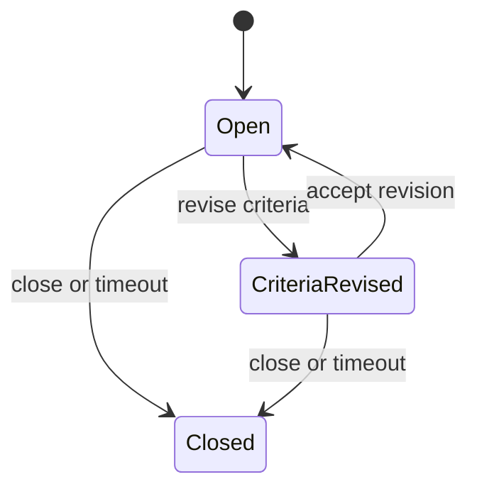
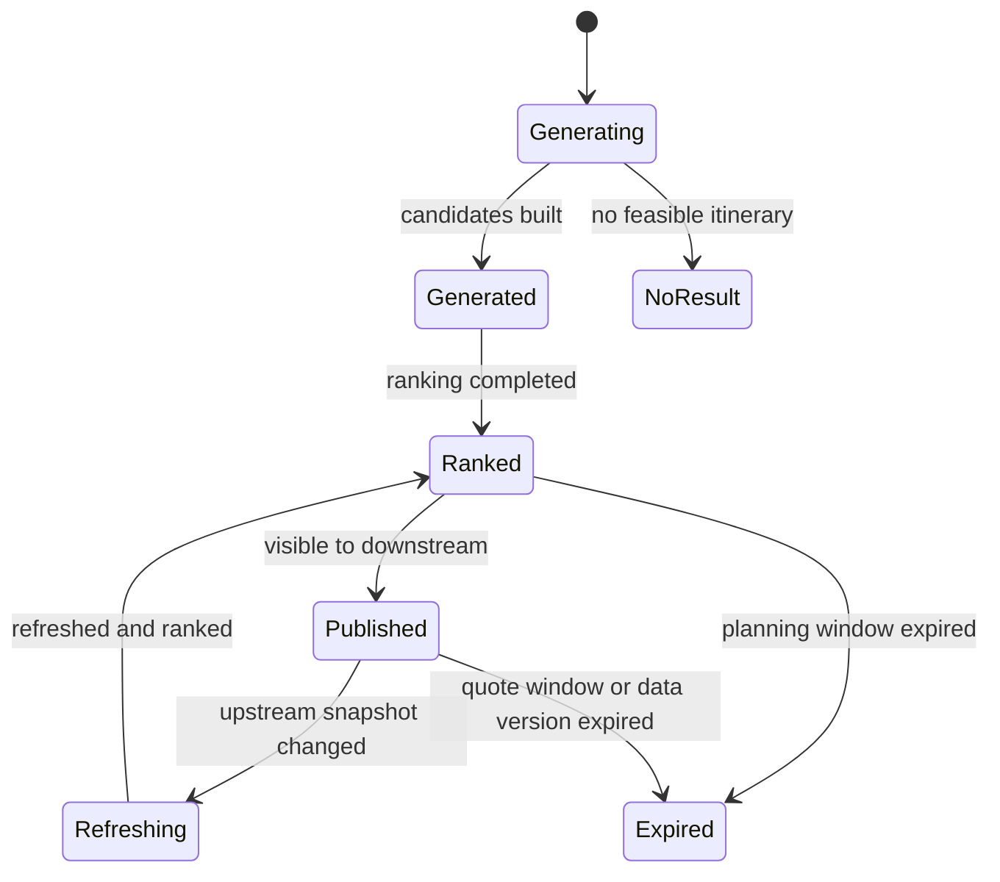

# Trip Planning Domain Design

## Metadata

| Field | Value |
|---|---|
| Domain | Trip Planning |
| Status | accepted-ddd-baseline |
| Owner Agent | agentm-trip-planning |
| Last Updated | 2026-06-28 |
| High-Level Inputs | `docs/01-ddd-high-level/domain-glossary.md`, `docs/01-ddd-high-level/context-map.md`, `docs/01-ddd-high-level/general-travel-ddd.md` |

## 1. 领域目标

Trip Planning 负责把用户的 `SearchCriteria` 转换为可比较、可解释、可继续报价的 `Itinerary` 和 `TripPlan` 候选。它是 General Travel 的核心域，因为用户是否能找到可行出行，首先取决于规划能力，而不是下单、支付或出票能力。

本 domain 覆盖火车、大巴、网约车、飞机、轮船，以及同方式和跨方式的 multimodal 联乘/中转。它关心端到端 `Journey` 是否可达、方案之间如何排序、哪些约束导致方案被排除、哪些风险需要在报价前显式暴露。

Trip Planning 的产出不是交易承诺：它不锁库存、不计算最终价格、不创建 `Offer`、不创建订单。它发布的是规划结果和解释，供 `Offer Management` 进一步生成带有效期、价格、规则和风险的可交易快照。

## 2. 边界

### In Scope

- 接收并规范化 `SearchCriteria`：起终点、出发/到达时间、旅客人数、交通方式、预算、时间窗、偏好和硬约束。
- 生成单方式直达、单方式中转、跨方式联乘、首末段接驳等 `Itinerary` 候选。
- 将候选组织为 `TripPlan`：包含多个可比较方案、排序结果、过滤原因和解释信息。
- 表达每个 `Itinerary` 的 `Segment`、`Transfer`、规划时间、交通方式、节点、风险提示和候选 `FareQuote` 引用。
- 根据可达性、最短换乘时间、行李衔接、无障碍需求、证件/安检时间、夜间停留、步行距离、最大换乘次数等规则进行约束评估。
- 区分保障联乘、供应商保障、平台协助和非保障 `Self Transfer` 的规划含义，并把保障能力要求传递给 `Transfer Management` 或 `Offer Management`。
- 对候选方案按时间、价格估计、换乘次数、准点率、风险、舒适度、无障碍适配、行李便利性和用户偏好排序。
- 发布规划事件和维护搜索读模型，用于后续报价、推荐、运营分析和降级。

### Out of Scope

- 不拥有 `Service Plan` 时刻表、航班计划、船班计划、班车计划或线路运营日历。
- 不拥有 `Place & Network` 的地理、站点、机场、港口、POI、换乘拓扑和距离权威数据。
- 不拥有 `Capacity & Availability` 的可售库存、票额、舱位、司机供给、配额或锁定。
- 不拥有 `Fare & Pricing` 的价格计算、税费、票规、优惠、退改规则或费用拆分。
- 不拥有 `Offer` 生命周期；`OfferQuoted`、`OfferExpired` 和价格快照由 `Offer Management` 负责。
- 不执行 `Booking`、`Reservation`、`Hold`、支付、出票、退改或供应商预订。
- 不处理履约事实、延误后实时中转状态和错过接续恢复；这些属于 `Fulfillment`、`Transfer Management` 和 `Disruption Recovery`。

## 3. 统一语言补充

| Term | Definition | Notes |
|---|---|---|
| SearchCriteria | 用户查询的结构化条件，包含起终点、时间、旅客、交通方式、偏好和约束 | 是 Trip Planning 的主要输入，可来自前端、推荐或客服 |
| PlanningConstraint | 规划必须满足或尽量满足的条件 | 区分 hard constraint 和 soft preference |
| TripPlan | 针对一次 SearchCriteria 生成的候选方案集合 | 包含排序、过滤、解释和版本信息 |
| ItineraryCandidate | 尚未进入报价的候选 Itinerary | 可被过滤、合并、降级或提升为对外展示方案 |
| PlanningScore | 方案排序分数 | 由时间、成本、风险、舒适度、偏好匹配等组成 |
| ExclusionReason | 候选被排除的原因 | 例如不可达、换乘不足、无库存快照、无障碍不满足 |
| AccessibilityRequirement | 无障碍出行需求 | 如轮椅、少步行、电梯、站内协助、优先登乘 |
| BaggageConstraint | 行李相关规划约束 | 如需要托运、直挂、自取、超大件、车辆上船 |
| ConnectionIntent | 用户对联乘保障的期望 | 可要求 protected、assisted 或允许 self-transfer |
| PlanningSnapshot | 规划时使用的上游数据版本集合 | 用于解释和重放，不代表交易锁定 |

## 4. 上下游契约

### Upstream

| Upstream Context | Consumed Contract | Reason |
|---|---|---|
| Place & Network | `PlaceGraph`, `TransportNode`, `NodeConnection`, `TransferTopology` | 解析地点、计算可达路径、判断同站/换站/换码头/首末段距离 |
| Service Plan | `ServiceSegment`, `Schedule`, `OperatingCalendar`, `StopPattern` | 生成火车、飞机、大巴、轮船等固定班次 Segment 候选 |
| Dispatch | `RideOptionEstimate`, `PickupWindow`, `VehicleClassAvailability` | 为网约车、接驳和首末段按需服务生成 Segment 候选 |
| Capacity & Availability | `AvailabilitySnapshot`, `InventorySignal`, `SupplyHealth` | 排除明显不可售或供应异常方案，但不锁库存 |
| Fare & Pricing | `FareQuote`, `FareBand`, `PriceHint` | 用于排序和预算过滤；最终价格仍由 Offer Management 冻结 |
| Traveler Profile | `TravelerPreference`, `AccessibilityProfile`, `DocumentCapability` | 应用旅客偏好、无障碍、证件和特殊服务需求 |
| Risk & Compliance | `SearchAllowed`, `PlanningRestriction`, `RateLimitSignal` | 限制异常查询、合规禁售区域或重复冲突风险 |
| Supplier Catalog | `CarrierCapability`, `SupplierModeCapability` | 判断供应商支持的交通方式、保障能力和服务等级 |

### Downstream

| Downstream Context | Published Contract | Reason |
|---|---|---|
| Offer Management | `ItinerarySelectedForQuote`, `TripPlanPublished`, `PlanningSnapshot` | 由报价上下文生成 Offer、有效期、规则和价格快照 |
| Transfer Management | `TransferPlanRequested`, `ConnectionIntent`, `TransferCandidate` | 深化换乘可行性、保障契约和运行中风险评估 |
| Journey Order | `ItineraryReference`, `TripPlanVersion` | 订单引用用户选择的方案来源，便于解释和追溯 |
| Disruption Recovery | `AlternativeItineraryRequested`, `PlanningConstraint` | 异常恢复复用规划能力寻找替代方案 |
| Reporting | `SearchPerformed`, `ItineraryProposed`, `ItineraryExcluded` | 分析查询成功率、无结果原因、供应缺口和排序效果 |
| Customer Service | `TripPlanReadModel`, `ExclusionReason` | 客服解释为什么某方案可见、不可见或风险较高 |

## 5. 聚合设计

| Aggregate Root | Invariants | Commands | Events |
|---|---|---|---|
| SearchSession | 同一 session 内 `SearchCriteria` 版本单调递增；每次规划必须绑定用户、渠道和时间窗；查询结果不能跨条件复用 | `StartSearchSession`, `ReviseSearchCriteria`, `CloseSearchSession` | `SearchSessionStarted`, `SearchCriteriaRevised`, `SearchSessionClosed` |
| TripPlan | 每个 `TripPlan` 必须引用一个 SearchCriteria 版本和 PlanningSnapshot；展示的 Itinerary 必须有排序和解释；过滤结果必须保留原因汇总 | `GenerateTripPlan`, `RefreshTripPlan`, `RankItineraries`, `PublishTripPlan` | `TripPlanGenerated`, `TripPlanRefreshed`, `ItineraryRanked`, `TripPlanPublished` |
| Itinerary | Itinerary 至少包含一个 Segment；相邻 Segment 之间必须有 Transfer 或明确无换乘；Segment 时间顺序不能重叠；不承诺最终可售 | `ProposeItinerary`, `EvaluateItinerary`, `ExcludeItinerary`, `MarkItineraryQuoteEligible` | `ItineraryProposed`, `ItineraryEvaluated`, `ItineraryExcluded`, `ItineraryMarkedQuoteEligible` |
| PlanningRuleSet | 规则版本不可变；规则必须区分硬约束和软偏好；排序权重必须可解释 | `ActivatePlanningRuleSet`, `RetirePlanningRuleSet`, `SimulatePlanningRuleSet` | `PlanningRuleSetActivated`, `PlanningRuleSetRetired`, `PlanningRuleSetSimulated` |

## 6. 状态机

### SearchSession 状态

### TripPlan 状态

### Itinerary 规划状态

| State | Meaning | Allowed Next |
|---|---|---|
| Candidate | 已生成但未完成约束评估 | Evaluating, Excluded |
| Evaluating | 正在评估时间、可达性、换乘、偏好和供应信号 | Feasible, Risky, Excluded |
| Feasible | 满足硬约束，可进入排序和报价候选 | QuoteEligible, Superseded |
| Risky | 可达但存在高风险或软约束不满足 | QuoteEligible, Excluded, Superseded |
| QuoteEligible | 可提交给 Offer Management 生成 Offer | Superseded, Expired |
| Excluded | 因硬约束失败或上游信号不可用而排除 | Superseded |
| Superseded | 被刷新版本替代 | 终态 |
| Expired | 所依赖规划快照过期 | 终态 |

## 7. 命令和领域事件

| Command | Aggregate | Event | Idempotency Key |
|---|---|---|---|
| StartSearchSession | SearchSession | SearchSessionStarted | `channelId:userId:clientRequestId` |
| ReviseSearchCriteria | SearchSession | SearchCriteriaRevised | `searchSessionId:criteriaVersion` |
| GenerateTripPlan | TripPlan | TripPlanGenerated | `searchSessionId:criteriaVersion:planningRequestId` |
| RefreshTripPlan | TripPlan | TripPlanRefreshed | `tripPlanId:upstreamSnapshotVersion` |
| ProposeItinerary | Itinerary | ItineraryProposed | `tripPlanId:itineraryFingerprint` |
| EvaluateItinerary | Itinerary | ItineraryEvaluated | `itineraryId:ruleSetVersion:snapshotVersion` |
| ExcludeItinerary | Itinerary | ItineraryExcluded | `itineraryId:exclusionReasonCode` |
| RankItineraries | TripPlan | ItineraryRanked | `tripPlanId:rankingProfileVersion` |
| PublishTripPlan | TripPlan | TripPlanPublished | `tripPlanId:publishedVersion` |
| MarkItineraryQuoteEligible | Itinerary | ItineraryMarkedQuoteEligible | `itineraryId:quoteEligibilityVersion` |
| ActivatePlanningRuleSet | PlanningRuleSet | PlanningRuleSetActivated | `ruleSetId:version` |

## 8. 策略和 Saga 参与点

- 当 `SearchCriteriaRevised` 发生时，Trip Planning 重新解析起终点、时间窗和约束，废弃旧 TripPlan 的展示资格，但保留用于分析的结果摘要。
- 当 `AvailabilitySnapshotChanged`、`ServicePlanChanged`、`PlaceGraphChanged` 或 `FareQuoteChanged` 到达时，策略判断是否需要 `RefreshTripPlan`；若变化只影响排序，则不重新生成全部候选。
- 当 `ItineraryMarkedQuoteEligible` 发布后，`Offer Management` 可以请求报价；Trip Planning 不等待报价完成，也不将报价失败解释为规划失败。
- 当用户要求 protected connection 时，Trip Planning 只生成满足保障候选条件的 Transfer，并调用 `Transfer Management` 进一步校验 `Connection Contract`。
- 当 `Disruption Recovery` 请求替代方案时，Trip Planning 以原 Journey、剩余 Segment、用户当前位置、时间压力和权益约束为输入生成恢复候选。
- 当上游供应商健康度下降时，Trip Planning 可降级为隐藏特定供应商、降低排序权重或展示“需报价确认”的风险说明。
- 当 Risk & Compliance 返回限制时，Trip Planning 在搜索阶段进行限流、隐藏方案或要求更具体的旅客信息，但不做支付风控决策。

## 9. 读模型

| Read Model | Source Events | Consumers |
|---|---|---|
| TripPlanSummary | `TripPlanGenerated`, `ItineraryRanked`, `TripPlanPublished` | 前端搜索结果页、客服、Offer Management |
| ItineraryComparison | `ItineraryProposed`, `ItineraryEvaluated`, `ItineraryRanked` | 前端排序、推荐、A/B 实验 |
| SearchNoResultAnalysis | `ItineraryExcluded`, `TripPlanGenerated` | 运营、供应优化、Reporting |
| TransferCandidateView | `ItineraryEvaluated`, `ItineraryMarkedQuoteEligible` | Transfer Management、Offer Management |
| PlanningSnapshotIndex | `TripPlanGenerated`, upstream snapshot references | 审计、问题排查、重放分析 |
| PreferenceMatchView | `SearchCriteriaRevised`, `ItineraryEvaluated` | 个性化排序、客服解释 |
| AccessibilityPlanView | `ItineraryEvaluated`, `ItineraryExcluded` | 无障碍服务、客服、前端提示 |
| BaggageConnectionView | `ItineraryEvaluated`, `ItineraryMarkedQuoteEligible` | Offer Management、Ancillary Service |

## 10. 外部系统和防腐层

Trip Planning 不直接对接铁路、航司、大巴公司、船司或网约车平台。外部供应商语言必须先由 `Provider Integration`、`Service Plan`、`Capacity & Availability`、`Fare & Pricing` 或 `Dispatch` 转换为平台统一契约。

需要的防腐层重点包括：

- 航空 `PNR`、航段舱位、票价族和最短衔接时间不进入 Trip Planning 聚合，只映射为 Segment 候选、FareQuote 引用和 Transfer 约束。
- 铁路车次、席别、区间票额映射为 ServiceSegment、AvailabilitySnapshot 和 FareQuote；区间库存规则不在 Trip Planning 内计算。
- 网约车司机、车辆、派单状态映射为 RideOptionEstimate 和 PickupWindow；司机接单前不被描述为强确认 Segment。
- 轮船舱房、铺位、车辆甲板映射为容量和行李/车辆约束；是否可售由 Capacity 与 Offer 确认。
- 地图、路径规划和交通耗时服务通过 Place & Network 或 Dispatch 提供标准化距离、耗时和可达性，不把第三方地图字段暴露给领域对象。

## 11. 当前服务迁移影响

| Current Service | Migration Impact |
|---|---|
| travel 查询接口 | 拆分为 `SearchCriteria` 接收、TripPlan 生成、Itinerary 读取；避免把车次查询、订单预填和价格展示混在一个接口 |
| preserve 相关预订前逻辑 | 预订前的方案选择迁移到 Trip Planning；占座、下单和供应商确认迁移到 Booking Orchestration |
| assurance/保险展示逻辑 | 作为 Ancillary Service 或 Offer 组合输入，不再影响 Itinerary 是否可达 |
| station/route 查询 | 权威数据归 Place & Network 和 Service Plan；Trip Planning 只消费标准节点和班次契约 |
| price 展示逻辑 | 搜索页可使用 FareQuote 或 PriceHint 排序；最终金额、税费和票规由 Offer Management 负责 |
| front-end search result DTO | 重构为 TripPlanSummary、ItineraryComparison、TransferCandidateView，明确规划结果与 Offer 的边界 |
| cache/index 服务 | 搜索索引按 PlanningSnapshot 和上游版本构建，缓存失效不应触发库存锁定或订单状态变化 |
| admin 配置 | 规划规则、排序权重和黑白名单迁移为 PlanningRuleSet，并记录版本、启用时间和审计信息 |

## 12. 验收标准

- Trip Planning 的聚合所有权明确：SearchSession、TripPlan、Itinerary、PlanningRuleSet 只保护规划不变量。
- Trip Planning 发布和消费的事件明确，并使用过去式领域事件表达已发生事实。
- `SearchCriteria` 到 `Itinerary` / `TripPlan` 的转换覆盖火车、大巴、网约车、飞机、轮船和 multimodal 联乘。
- 文档明确 Trip Planning 不拥有 Service Plan、Place & Network、Capacity、Fare & Pricing、Offer 生命周期和 Booking 执行。
- 规划约束覆盖搜索条件、排序、偏好、可达性、换乘可行性、保障/非保障联乘、无障碍和行李。
- 状态机只定义本 domain 拥有的 SearchSession、TripPlan 和 Itinerary 规划状态，不定义订单、库存、支付或票证状态。
- 读模型能够支持搜索展示、报价衔接、客服解释、无结果分析和规划重放。
- ACL 设计避免供应商原始语言污染核心模型。
- 当前服务迁移影响覆盖历史查询、预订前逻辑、价格展示、缓存和后台配置。
